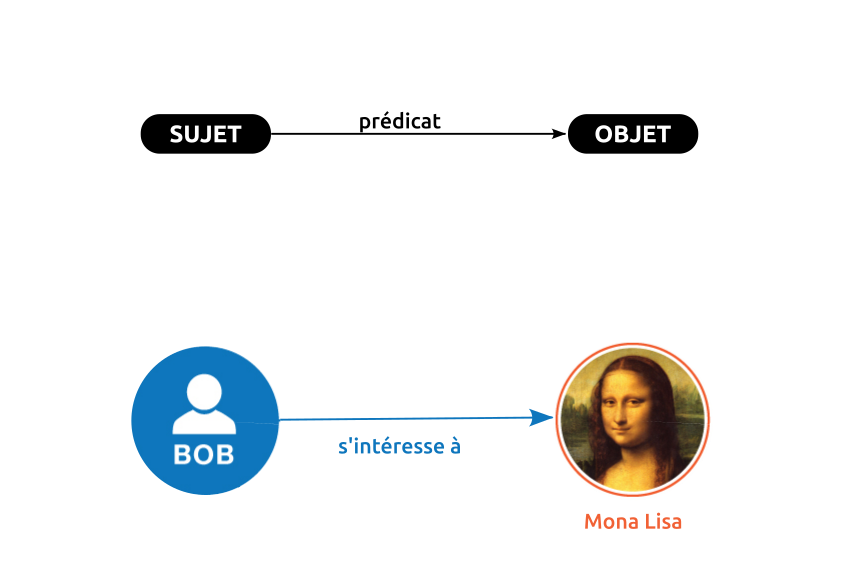
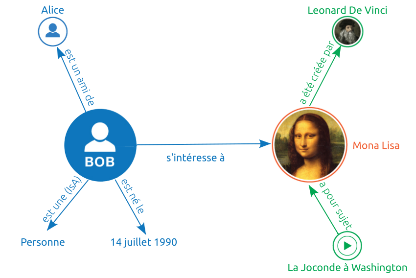
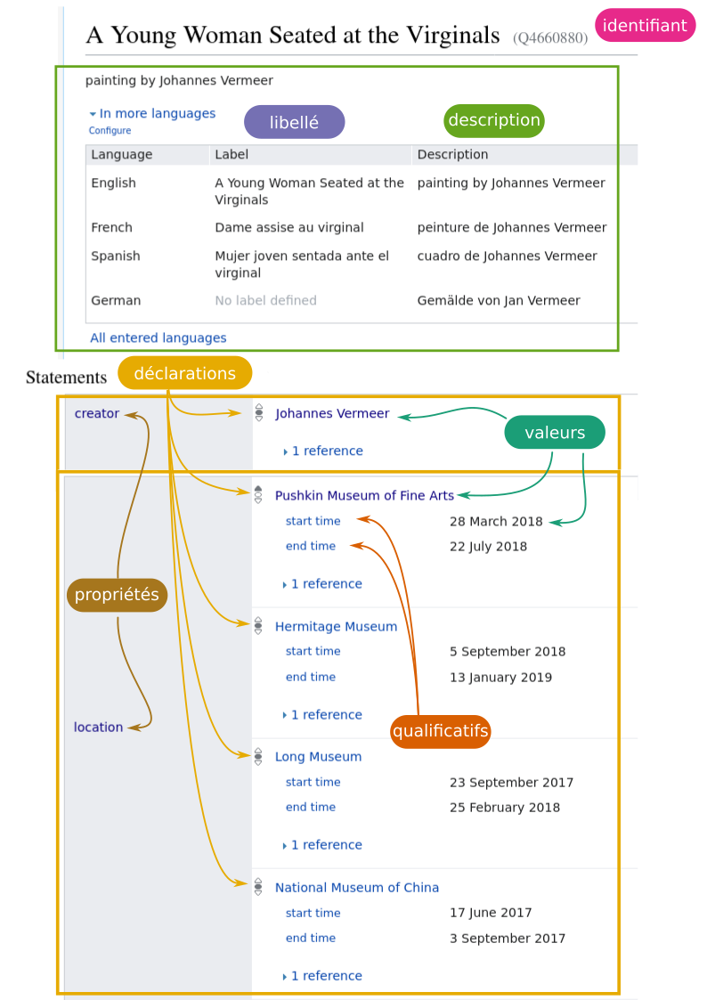
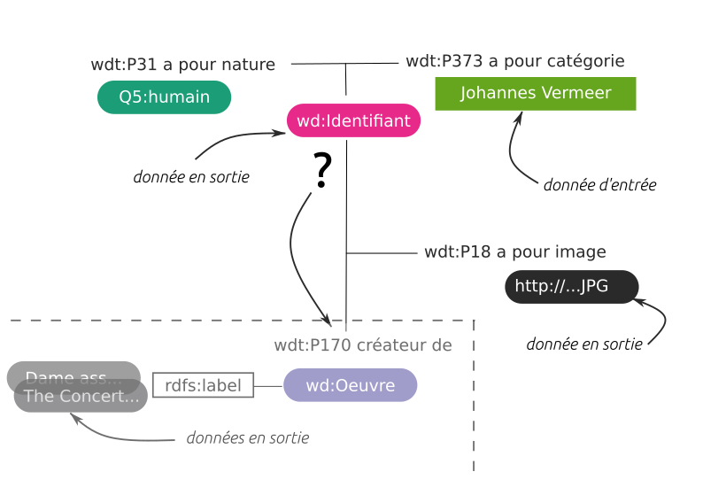
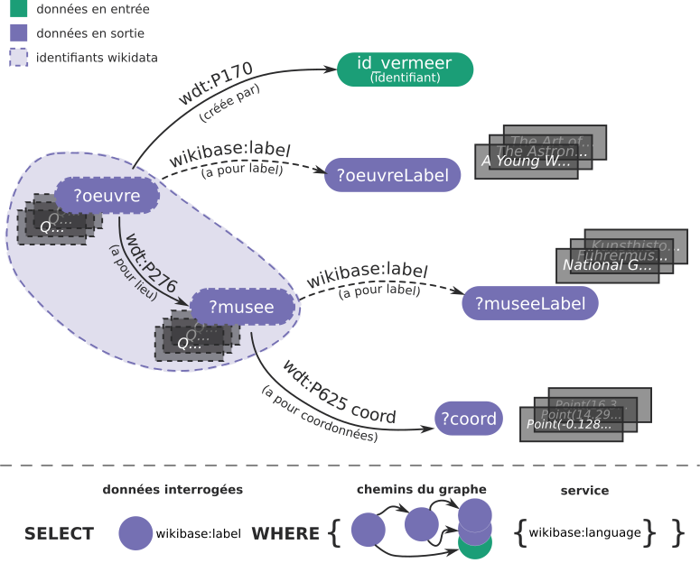
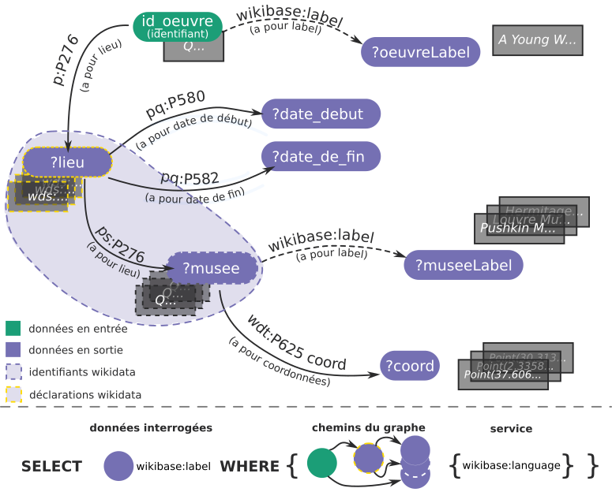

```{r configuration, include=FALSE}

## Global options
knitr::opts_chunk$set(echo=TRUE,
        	            cache=FALSE,
                      prompt=FALSE,
                      comment=NA,
                      message=FALSE,
                      warning=FALSE,
                      class.source="bg-info",
                      class.output="bg-warning")


```

> Cette fiche est le fruit d'un dialogue interdisciplinaire entre membres du [GT Notebook](https://gitlab.huma-num.fr/gt-notebook){target="_blank"} initié dans le cadre d'un [atelier](https://gt-notebook.gitpages.huma-num.fr/workshop/workshop_3_decembre_2021/slide2html-3-dec/){target="_blank"} proposé à la [*Journée d’études normande sur les données de la recherche*](https://www.unicaen.fr/evenement/journee-detude-normande-sur-les-donnees-de-la-recherche/){target="_blank"} qui s'est déroulée en décembre 2021. L'association de plusieurs compétences et disciplines a abouti à ce *notebook* présentant une analyse exploratoire reproductible de données ouvertes et liées d'un fragment de graphe Wikidata, interrogeables sous la forme de triplets RDF. Les enjeux d'un tel processus inter-disciplinaire sont esquissés en conclusion. Une ébauche des requêtes SPARQL élaborées a fait l'objet d'une présentation et d'échanges au sein des [Ateliers du Web Sémantique](https://les-ateliers-du-web-semantique.gitpages.huma-num.fr/les-ateliers-du-web-semantique/){target="_blank"} au printemps 2021.

# Introduction {-}

Cette fiche présente une exploration du graphe Wikidata (cf. [parties 1.2](#standard-rdf-du-w3c) et [3](#exploration-du-graphe-wikidata)) et le traitement des données extraites (cf. [parties 2](#packages-et-données) et [4](#exploration-spatiale)). 

Du requêtage en langage SPARQL (cf. [partie 1.3](#le-langage-sparql)) au traitement et à la représentation des données issues du graphe Wikidata, ce document présente, étape par étape, l'ensemble de la chaîne de traitement réalisée. Le processus exploratoire, parfois itératif, a été conservé afin de mieux comprendre l'approche réflexive des auteurs et autrice. Le *notebook* retranscrit les démarches scientifique et méthodologique adoptées.

Le schéma organisant ces données est esquissé dans la [partie 1](#wikimédia-wikidata-w3c). Afin de permettre une reproduction des traitements et des résultats présentés, les données automatiquement collectées au `r format(Sys.time(), "%d %B %Y")` et utilisées dans ce document sont mises à disposition (cf. [partie 2.2](#données-collectées)). L'idée de départ conduit à la démarche suivante en 3 étapes : 

- requêter les données (ou suivre des chemins) du graphe Wikidata,  
- identifier certaines des modalités du graphe pouvant comporter une dimension spatiale et temporelle et ainsi,  
- reconstruire et représenter une ou des trajectoires dans le temps et l'espace. 

Compte-tenu du [formalisme](https://www.wikidata.org/wiki/Wikidata:WikiProject_Ontology/Modelling){target="_blank"} et de l'hétérogénéïté des données non supervisées de Wikidata, deux images d'objet sont choisies pour l'étude : un artiste-peintre et une de ses peintures, exposée au sein de musées ou d'institutions culturelles dans le monde. Pour reproduire partiellement l'expérimentation, un exemple d'exploration du graphe Wikidata pour diverses images d'artistes-peintres est proposée dans la [partie 7](#à-vous-dexplorer).
<br/><br/>

---

NB : le terme "image" utilisé dans ce document correspond à une sémantique de l'objet physique présent dans l'espace numérique sous la forme de données et de métadonnées en relation avec d'autres images d'objet, selon @hui_induction_2015. En ce sens, les œuvres elles-mêmes, photographiées ou scannées etc. sous les formes de fichiers d'extension .jpg .png etc. sont désignées par le terme d'"illustration" ou de fichiers. Pour simplifier le discours, l'image d'objet est désignée par l'objet lui-même : par exemple, l'image du peintre Johannes Vermeer, l'entité Wikidata de valeur [`Q41264`](https://www.wikidata.org/wiki/Q41264){target="_blank"} définie par ses relations dans l'espace numérique, désigne le peintre lui-même. Le fichier .jpg Wikidmédia de son auto-portrait supposé, fragment de l'oeuvre intitulée l'Entremetteuse, est une illustration représentant le peintre.

---

# Wikimédia, Wikidata & W3C
## Données ouvertes et liées du graphe Wikidata
Wikidata est une base de connaissances libre, éditée de manière collaborative et hébergée par la [fondation Wikimedia](https://wikimediafoundation.org/fr/){target="_blank"}. Son contenu étant placé sous [licence CC0](https://creativecommons.org/publicdomain/zero/1.0/deed.fr){target="_blank"} (« Transfert dans le Domaine Public »), elle permet de centraliser l'accès aux données utilisées par différents [projets Wikimedia](https://www.wikimedia.fr/les-projets-wikimedia/){target="_blank"} (@frwiki:186068284).

Les informations saisies dans Wikidata sont des données ouvertes “brutes” multilingues non-supervisées qui sont liées, notamment aux articles de l'encyclopédie contributive Wikipedia. Wikidata est à différencier de l'ontologie DBpedia^[**DBpedia** est une ontologie permettant de traduire Wikipedia en dépôts de données définis dans le cadre de description des ressources du standard *Ressources Description Framework* (RDF) du *World Wide Web Consortium*^[Le **World Wide Web Consortium**, abrégé par le sigle **W3C**, est un organisme de standardisation à but non lucratif, fondé en octobre 1994 chargé de promouvoir la compatibilité des technologies du World Wide Web telles que HTML5, HTML, XHTML, XML, RDF, SPARQL, CSS, XSL, PNG, SVG, MathML et SOAP.] (W3C)] (figure 1).
```{r figure1, out.width="80%",  fig.align = 'center',  echo=FALSE, purl = FALSE }
knitr::include_graphics('figures/wikidata_vs_dbpedia.png')
```
<center>
*Figure 1 : Principales différences entre des données Wikipedia (DBpedia) et des données Wikidata. Dbpedia est la façon dont Wikipedia est traduit en dépôts de triplets RDF statique. <br/>Source : [Wikidata-Basics | Wikidata Hackathon event for the Festival of Creative Learning, 2018](https://thinking.is.ed.ac.uk/wikidata-basics/faq-and-further-reading/){target="_blank"}*
</center>
<br/>
La base Wikidata fournit un support à de nombreux autres sites et services au-delà des seuls projets de Wikimedia. Son contenu est exporté dans des formats standards et peut être lié ou aligné à d'autres ensembles de données ouvertes sur le Web des données^[Le **Web de données** (*linked data*, en anglais) est une initiative du World Wide Web Consortium^[Le **W3C** est un organisme de standardisation à but non lucratif, fondé en octobre 1994 chargé de promouvoir la compatibilité des technologies du World Wide Web telles que HTML5, HTML, XHTML, XML, RDF, SPARQL, CSS, XSL, PNG, SVG, MathML et SOAP.] visant à favoriser la publication de données structurées sur le Web, non pas sous la forme de silos de données isolés les uns des autres, mais en les reliant entre elles pour constituer un réseau global d'informations.]. Wikidata offre ainsi un large domaine d'informations générales sur notre univers ou ses représentations et des liens vers d'autres graphes ou bases de données. Il contient à ce jour plus de 100 millions d'items. 
<br/>

## Standard RDF du W3C 

Le RDF (Resource Data Framework) est un cadre général de modélisation utilisé pour décrire formellement les ressources du Web via leurs métadonnées afin de permettre le traitement par inférence de telles descriptions. Développé par le W3C^[Le **World Wide Web Consortium** (**W3C**) est un organisme de standardisation à but non lucratif fondé en 1994 et chargé de promouvoir la compatibilité des technologies du Web], le RDF est le formalisme de base du [Web sémantique]((https://fr.wikipedia.org/wiki/Web_s%C3%A9mantique){target="_blank"}). 

Au sein de ce paradigme, un document ou une ressource consiste en un ensemble de triplets^[Un **triplet** est un groupe formé par trois éléments dont chacun appartient à un ensemble distinct.], chacun associant un sujet, un prédicat et un objet :  
- le «sujet» représente la ressource à décrire,  
- le «prédicat» représente un type de propriété applicable à cette ressource,  
- l'«objet» représente une donnée, une autre ressource ou une valeur associée à la propriété (ou prédicat). 

Le sujet et l'objet, dans le cas où ce sont des ressources, peuvent être identifiés par un identifiant unique de la ressource (URI^[Un **URI** (*Uniform Resource Identifier*, en français *Identifiant unique de ressource*) est une chaîne qui fait référence à une ressource. Les plus courantes sont les URL, qui identifient une ressource en donnant son emplacement sur le Web. Au contraire, les URN font référence à une ressource grâce à son nom, dans un environnement donné, par exemple le code ISBN d'un livre.]), une valeur ou être des nœuds anonymes. Le prédicat est nécessairement identifié par un URI. 
Par exemple, la déclaration "Bob s'intéresse à Mona Lisa" est formalisée de la manière suivante :
```{r figure2, out.width="70%", fig.align = 'center',  echo=FALSE, purl = FALSE }

```
<center>
*Figure 2 :  Exemple de représentation des composantes génériques d'un triplet RDF. </br> Source : [W3C](https://www.w3.org/TR/rdf11-primer/){target="_blank"}*
</center>
</br>
Un dépôt de triplets RDF ainsi formé correspond à un multigraphe orienté étiqueté : chaque triplet correspond alors à une arête orientée dont l'étiquette est le prédicat, le sujet est le nœud source et l'objet est le nœud cible (figure 3).
</br>
```{r figure3, out.width="70%", fig.align = 'center',  echo=FALSE, purl = FALSE }


```
<center>
*Figure 3 : Exemple de graphe formé par plusieurs triplets RDF. </br> Source : [W3C](https://www.w3.org/TR/rdf11-primer/){target="_blank"}*
</center>
</br>

## Le langage SPARQL

SPARQL^[**SPARQL** est acronyme récursif qui signifie **S**PARQL **P**rotocol **A**nd **R**DF **Q**uery **L**anguage (@frwiki:194953405). Plusieurs langages de requête destinés à interroger les graphes RDF ont été développés, mais le langage SPARQL est développé par le W3C de sorte à devenir un standard.] (prononcé *sparkle*, en anglais : « étincelle ») est à la fois un langage de requête et un protocole qui permettent de rechercher, d'ajouter, de modifier ou de supprimer des triplets RDF disponibles à travers le Web. Aujourd'hui, le Web de données (représenté par le [nuage du *Linked Open Data*](http://cas.lod-cloud.net/){target="_blank"} ou [ses domaines](http://cas.lod-cloud.net/#subclouds){target="_blank"}) est interrogeable via des centaines de services SPARQL qui mettent à disposition de plus en plus de graphes de données ouvertes et liées comme c'est le cas du projet plurilingue Wikidata (@frwiki:194953405).

Dans Wikidata les entités et leurs coordonnées spatiales et temporelles sont modélisées selon les fragments de graphes (XML, json, turtle etc.). Ceux-ci comprennent des classes instanciées (domaine et co-domaine) liées entre elles par des prédicats, mobilisant une syntaxe spécifique associée à chaque [espace de nom](https://www.w3.org/TR/REC-xml-names/#NT-Prefix){target="_blank"} mobilisant des préfixes^[Un **préfixe** est une modalité de simplification d'écriture faisant référence à un *espace de noms*, voir notamment, les [préfixes Wikidata](https://www.wikidata.org/wiki/EntitySchema:E49){target="_blank"}] : 

---

prédicat = préfixe:propriété  <br>
domaine/co-domaine = préfixe:entité

---

Le tableau suivant récapitule les classes et propriétés utilisées, ainsi que les préfixes associés pour former les triplets :

| classe ou propriété | préfixes |  exemple(s) de chemin | label wikidata |
|-|-|------|----|
| Q5 | `wd` | ?identifiant wdt:P31 **wd:Q5** | [être humain](https://www.wikidata.org/wiki/Q5) |
| P31 | `wdt` | ?identifiant **wdt:P31** wd:Q5 | [nature de l’élément](https://www.wikidata.org/wiki/Property:P31) |
| P373 | `wdt` | ?identifiant **wdt:P373** 'Johannes Vermeer' | [a pour catégorie](https://www.wikidata.org/wiki/Property:P373)|
| P18 | `wdt` | ?identifiant **wdt:P18** ?image | [a pour image](https://www.wikidata.org/wiki/Property:P373) |
| P170 | `wdt`, `p`, `ps` | ?oeuvre **wdt:P170** wd:Q41264 <br> OU <br> ?oeuvre* **wdt:P170** wd:Q41264 | [créé par](https://www.wikidata.org/wiki/Property:P170) <br> (Q41264 identifie le peintre Johannes Vermeer)|
| P276 | `wdt`, `p`, `ps` | ?oeuvre wdt:P276 ?lieu OU <br> ?oeuvre p:P276 ?lieu* | [lieu](https://www.wikidata.org/wiki/Property:P276) |
| P625 | `wdt` | ?musee wdt:P625 ?coord | [coordonnées](https://www.wikidata.org/wiki/Property:P625) |
| P580 | `pq` | ?lieu* pq:P580 ?dated | [date de début](https://www.wikidata.org/wiki/Property:P580) |
| P582 | `pq` | ?lieu* pq:P582 ?datef | [date de fin](https://www.wikidata.org/wiki/Property:P582) |
| label, language | `wikibase` | SERVICE wikibase:label { <br> bd:serviceParam wikibase:language \"[AUTO_LANGUAGE], fr,en \".} | syntaxe du service de langue wikidata |
*dans le cas où la propriété est directe, c'est à dire que le préfixe `p` est utilisé au lieu du préfixe `wdt`, le résultat ou la donnée est une assertion. Cette spécificité du graphe wikidata est abordée dans la partie [3](#exploration-du-graphe-wikidata).

# *Packages* et données

## *Packages* utilisés

Les *packages* utilisés pour réaliser l'ensemble de la chaîne de traitement présenté dans ce document sont les suivants :
</br>

- `wikidataR`^[[`WikidataR`](https://cran.r-project.org/web/packages/WikidataR/index.html){target="_blank"} est développé par Thomas Shafee, Os Keyes, Serena Signorelli, Alex Lum, Christian Graul et Mikhail Popov (développeur de `WikidataQueryServiceR`), membre de la Fondation Wikimédia. Il est maintenu par Thomas Shafee de l'université australienne La Trobe de l'état Victoria.] (et son extension `WikidataQueryServiceR`) : permet d'écrire une requête pour interroger le graphe de données Wikidata au moyen d'une Interface de Programmation d’Application (API) pour le service de requêtes Wikidata en langage SPARQL^[ Le [service de collecte des données de Wikidata en langage SPARQL](https://query.wikidata.org/){target="_blank"} offre une solution très complète en première approche (exemples, assistant de requêtes, diversité des représentations etc.). Toutefois, dans une dynamique d'exploration du graphe Wikidata, l'utilisation de R facilite la compréhension, l'archivage et la reproductibilité des différentes requêtes spécifiques réalisées. Pour cette raison, nous utilisons le package [`WikidataR`](https://www.rdocumentation.org/packages/WikidataR/versions/2.3.3){target="_blank"} ou alternativement [`WikidataQueryServiceR`](https://cran.r-project.org/web/packages/WikidataQueryServiceR/index.html){target="_blank"} qui est un package ayant des fonctionnalités plus développées.];  
- `glitter` : permet l'écriture de requêtes SPARQL sans maîtriser la syntaxe de ce langage, pour sonder divers graphes (dont Wikidata);    
- `rnaturalearth` : met à disposition les données géographiques de [Natural Earth](https://www.naturalearthdata.com/){target="_blank"};  
- `sf` : permet la gestion et la manipulation de données géographiques vectorielles;  
- `dplyr` : pour la manipulation des données;     
- `mapview` : pour l'affichage interactif de données géographiques (repose sur la librairie [JavaScript Leaflet](https://leafletjs.com/){target="_blank"});  
- `tmap` : pour la création de cartes thématiques;  
- `ggplot2` : permet la production de graphiques basés sur la [grammaire graphique](https://link.springer.com/book/10.1007/0-387-28695-0){target="_blank"};  
- `av` : génère des vidéos à partir d'images ou de graphiques R;  
- `patchwork` : permet de combiner plusieurs graphiques `ggplot2` dans la fenêtre graphique;  
- `jpeg` : permet l'import, l'enregistrement et l'affichage des images matricielles (format bitmap);  
- `DT` : pour la mise en forme dynamique (HTML) de tableau de données (bibliothèque javascript [DataTables](https://datatables.net/){target="_blank"}).  


Vous pouvez utiliser les lignes de code suivantes pour installer ces *packages* :

```{r installationdespackages1, eval=TRUE, echo=TRUE, include=TRUE, message=FALSE, warning=FALSE}

# Liste des packages du CRAN nécessaires
liste_packages <- c("WikidataR",
                    "WikidataQueryServiceR",
                    "remotes",
                    "rnaturalearth",
                    "sf",
                    "dplyr",
                    "mapview",
                    "tmap",
                    "ggplot2",
                    "av",
                    "patchwork",
                    "jpeg", 
                    "DT")

# Packages à installer
liste_packages_a_installer <- liste_packages[!(liste_packages %in% installed.packages()[,"Package"])]

# Installation des packages manquants
install.packages(liste_packages_a_installer)
```

L'installation du package `glitter`, qui n'est pas encore disponible sur le CRAN, se fait de la manière suivante :

```{r installationdespackages2, eval=FALSE, echo=TRUE, include=TRUE, message=FALSE, warning=FALSE}

# Dépôt GitHub : https://github.com/lvaudor/glitter/
install.packages("remotes")
remotes::install_github("lvaudor/glitter")

```


L'ensemble des informations du système d"exploitation et des versions de *packages* utilisés pour générer ce *notebook* est disponible en <a href="#info-session">fin de document</a>.   
<br />

## Données collectées 

Plusieurs sources de données sont utilisées pour ce travail exploratoire :

1) des données issues du graphe Wikidata,    
2) une couche géographique [Natural Earth](https://www.naturalearthdata.com/){target="_blank"},      
3) et des fonds de carte accessibles via [Leaflet](https://rstudio.github.io/leaflet/basemaps.html){target="_blank"}.         

**Afin de maximiser la reproductibilité du code présenté, les jeux de données 1 et 2 ont été archivés et sont disponibles au téléchargement :**
<br/>
<p class="center">[<span style="font-size: 230%;" class="glyphicon glyphicon-download-alt"></span> <br/> Télécharger les données](https://github.com/rzine-reviews/wikidata_sparql_rzine/raw/main/data.zip)</p>
<br/>

<div class="alert alert-success" role="alert"><b>Wikidata est un graphe de données ouvertes et liées, régulièrement mis à jour. Une requête réalisée à deux dates différentes est susceptible de renvoyer un résultat différent.</b></div> 


<br/>

# Exploration du graphe Wikidata

Voici quelques éléments basiques du langage SPARQL permettant d'[interroger la base de données Wikidata](https://www.wikidata.org/wiki/Wikidata:Data_access#How_can_I_get_data_out_of_Wikidata?){target="_blank"} 

- la clause [`SELECT `]((https://www.w3.org/TR/sparql11-query/#select){target="_blank"}) des données interrogées qui renvoit les variables spécifiques (ou avec `COUNT` qui renvoit le nombre des ces données ou `GROUP_CONCAT` qui les concatène au sein d'une collection, regroupées par `GROUP BY` et triées par `ORDER BY`),  
- accompagnée de la clause [`WHERE { }`]((https://www.w3.org/TR/sparql11-query/#where){target="_blank"}) qui les lie à l'interrogation de propriétés et données associées, suivant les chemins du graphe,    
- un service WikiLabel spécifique au point d'accès *Wikidata Query Service*,  du fait du caractère plurilingue de certaines données du graphe Wikidata, permettant de choisir la langue du label (`wikibase:language`) associé à l'entité ou la propriété recherchée,  
- la fonctionnalité `OPTIONAL` de la clause `WHERE` qui permet de renvoyer les variables même si les données liées aux propriétés ne sont pas instanciées (noeuds vides),    
- et les différents préfixes associés aux spécificités des propriétés simples, directes et indirectes etc. des fragments de graphe de Wikidata ([+d'info](https://linkeddatafragments.org/){target="_blank"}). 
<br/>

Afin de permettre une bonne compréhension des requêtes réalisées pour la collecte de données sans entrer dans le détail de la syntaxe propre à SPARQL, celles-ci sont formulées de la manière suivante (les éléments en italique ne sont pas nécessaires) : 

---

`SELECT` **données interrogées**, *comptage* ou *concatenage* `WHERE {` **chemins principaux du graphe**, *service Wikilabel, filtre, chemins optionnels ou secondaires du graphe* `}` *groupe et ordonne*

---

<br />

## Modèle des données : artistes-peintres et trajectoires de leurs œuvres

Le fragment de graphe de l'image Wikidata d'une peinture, objet du processus exploratoire, est illustré sous la forme d'un tableau dans la figure 4 ci-dessous. 

```{r figure4, out.width="80%", fig.align = 'center', echo=FALSE, purl=FALSE}

```

<center>
*Figure 4 : Représentation tabulaire d'une entité Wikidata avec les principaux termes utilisés. Les déclarations de localisation ou du créateur (statements en jaune sur le schéma) peuvent utiliser des valeurs (en vert) et des qualificatifs (qualifiers, en orange), ici associés aux données de lieux et aux laps de temps. <br/> Source : [Wikidata]((https://www.wikidata.org/wiki/Wikidata:Introduction){target="_blank})*
</center>
</br>    

Pour plus d'informations, vous pouvez consulter l'[introduction à Wikidata](https://www.wikidata.org/wiki/Wikidata:Introduction/fr){target="_blank"} ou la [page Wikibase](https://www.mediawiki.org/wiki/Wikibase/Indexing/RDF_Dump_Format){target="_blank"} dédiée au formalisme du *Ressource Description Framework* (RDF) du dépôt de données Wikidata.

Après plusieurs explorations, nous avons décidé de nous intéresser, dans une première étape, au peintre néerlandais du 17e siècle, **Johannes Vermeer**. 

Un fonction du package `WikidataR` permet d'interroger le graphe à partir d'une chaîne de caractère. Par exemple, il est possible de collecter les entités (*item*) correspondant à la chaîne de caractère "Johannes Vermeer" :

```{r requetesparql0,  eval=TRUE, echo=TRUE, include=TRUE, warning=FALSE, message=FALSE}

# Package API pour interroger le dépôt Wikidata : WikidataR
library(WikidataR)

## Chercher les entités du graphe Wikidata correspondant à "Johannes Vermeer"
resultat_item <- find_item("Johannes Vermeer")

resultat_item

```

Une seule entité de valeur `Q41264` parmi les dix collectées semble correspondre à l'image au sens de [@hui_induction_2015] de l'objet Johannes Vermeer, le peintre recherché. Le résultat de la requête `find_item` est composé d'un ensemble d'informations (`$id`, `$repository`, etc.). 

```{r affichage0entite,  eval=TRUE, echo=TRUE, include=TRUE, warning=FALSE, message=FALSE}
as(resultat_item[[1]],"list")
```

Le champ `match` correspond à la chaîne de caractère recherchée : il est de `$type` label, en`$language` *en*, sous forme de `$text` *Johannes Vermeer*.  <br>

Pour connaître les propriétés (*properties*) associées à celle de "peintre" :


```{r affichage0propriete,  eval=TRUE, echo=TRUE, include=TRUE, warning=FALSE, message=FALSE}

## Chercher les propriétés du graphes correspondant à "peintre"
resultat_property <- find_property("peintre")

resultat_property

```

La propriété associée au peintre (`P170`) semble être celle liant un créateur à son œuvre ou autre objet. Le champ `$match` est une forme textuelle, de type alias en langue française :

```{r affichage0propriete2,  eval=TRUE, echo=TRUE, include=TRUE, warning=FALSE, message=FALSE}

resultat_property[[1]]$match

```


Ces premières investigations du graphe permettent de comprendre que pour collecter de manière précise des données spatio-temporelles associées aux œuvres créées par Johannes Vermeer, les modalités d'interrogation du fragment de graphe nécessitent d'identifier de manière suffisamment explicite l'entité recherchée telle qu'elle est modélisée au sein de l'ontologie.

## Déterminer l'identifiant Wikidata d'un peintre {.tabset}

A cette fin, nous interrogeons le graphe Wikidata en définissant le peintre Johannes Vermeer comme une instance de Wikidata (classe d'objet [P31](https://www.wikidata.org/wiki/Property:P31){target="_blank"}) qui est un humain ([Q5]((https://www.wikidata.org/wiki/Q5){target="_blank"})) et répondant à la catégorie commune ([P373](https://www.wikidata.org/wiki/Property:P373){target="_blank"}) "Johannes Vermeer". Ce fragment de graphe est illustré dans le schéma simplifié proposé dans la figure 5.

```{r figure5, out.width="75%", fig.align = 'center', echo=FALSE, purl = FALSE }

```  
<center>
*Figure 5 : Schéma des triplets de données d'entrée et de sortie du fragment de graphe Wikidata exploré. La clause `SELECT` s'applique aux éléments figurés en données en sortie. Les propriétés et objets associés (en entrée ou sortie), c'est-à-dire les chemins du graphe, sont insérés dans l'accollade de `WHERE`.*
</center>
</br> 

A l'aide de la fonction `query_wikidata` du package `WikidataR`, nous commençons dans un premier temps par obtenir l'identifiant wikidata du peintre et l'illustration qui lui est associée grâce à l'usage de la propriété [P18]((https://www.wikidata.org/wiki/Property:P18){target="_blank"}). Il est possible de réaliser la requête équivalente de manière plus concise avec les fonctions du package `glitter`.


### **WikidataR** {-}

```{r requetesparql1,  eval=TRUE, echo=TRUE, include=TRUE, warning=FALSE, message=FALSE}
#---
# Package API du CRAN pour interroger le dépôt Wikidata : WikidataR
 library(WikidataR)

## Chercher les entités du graphe Wikidata
 #- Définir les données recherchées
  id_wikidata <- paste("?identifiant")
  donnee_image <- paste("?image")
  
donnees_interrogees <- paste(id_wikidata,donnee_image)
 
## Construire les chemins du graphe

 #- Définir les entités wikidata utilisées : un humain (Q5)
  id_humaine <- paste0("Q5")
 #- Préfixe d'entité utilisé
  prefixe_entite <- paste("wd:")

 #- Définir la classe utilisée
  entite_humaine <- paste0(prefixe_entite,id_humaine)

 #- Définir les propriétés utilisées
  propriete_type <- paste("P31")
  propriete_categorie <- paste("P373")
  propriete_image <- paste("P18")
 #- Préfixe de propriété utilisé
  prefixe_propriete_simple <- paste("wdt:")
 
 #- Définir les prédicats utilisés
  predicat_type <- paste0(prefixe_propriete_simple,propriete_type)
  predicat_categorie <- paste0(prefixe_propriete_simple,propriete_categorie)
  predicat_image <- paste0(prefixe_propriete_simple,propriete_image)
 
 #- Chemins du graphe
  chemin_principal <- paste(id_wikidata,predicat_type,entite_humaine)
  chemin_categorie <- paste(id_wikidata,predicat_categorie,"'Johannes Vermeer'")
  chemin_image <- paste(id_wikidata,predicat_image,donnee_image)
  
chemins_du_graphe <- paste(chemin_principal,".",chemin_categorie,".",chemin_image)

## Construire la requête
query <- paste("SELECT",donnees_interrogees,"WHERE {",chemins_du_graphe,"}")
 
## Exécuter la requête
data1w <- query_wikidata(query)

## Affichage
data1w 
```

### **glitter** {-}

```{r requetesparql1b,  eval=TRUE, echo=TRUE, include=TRUE, warning=FALSE, message=FALSE}

# Package API en développement pour interroger un dépôt RDF sans connaître la syntaxe SPARQL : glitter
library(glitter)
  
## Initier la requête et stocker le résultat dans data1
 data1 <- spq_init() |>
## Ajouter les chemins du graphe
          spq_add("?identifiant wdt:P31 wd:Q5") |>
          spq_add(". wdt:P373 'Johannes Vermeer'") |>
          spq_add(". wdt:P18 ?image") |>
## Executer la requête
          spq_perform()
## Affichage
data1 
```

```{r inscriptiondesdonnees1,  eval=TRUE, echo=FALSE, include=FALSE}
write.csv(x = data1, file = "data/data1.csv", row.names = FALSE)
data1 <- read.csv("data/data1.csv", row.names = NULL)
```


Le résultat renvoyé par cette requête nous permet de vérifier que l'**image de l'objet Johannes Vermeer est bien identifiée par l'entité [**Q41264**]((https://www.wikidata.org/wiki/Q41264){target="_blank"}) dans Wikidata ** et/ou son URI. 
</br>

A partir de l'URI récupérée, nous téléchargeons l'image associée au peintre en deux étapes.

1. création d'un répertoire

```{r dossierimage, eval=TRUE, echo=TRUE, include=TRUE, warning=FALSE}
# Création des sous-répertoires 'data' et 'data/image'
dir.create("data")
dir.create("data/images")
```

2. Téléchargement et enregistrement

```{r telechargement,  eval=TRUE, echo=TRUE, include=TRUE, warning=FALSE, message=FALSE}
# Téléchargement et sauvegarde du fichier de l'image numérisée
download.file(url = data1$image,
              destfile = 'data/images/portrait_artiste.jpg',
              mode = 'wb')
```


```{r figure6, echo=FALSE, out.width="45%", fig.align = 'center', purl = FALSE }
 knitr::include_graphics('data/images/portrait_artiste.jpg')
```
<center>
*Figure 6 : Elément visuel de Wikimédia, lié à Wikidata, permettant d'identifier le peintre Johannes Vermeer.*
</center>
</br>    


<!-- Dans ce qui suit, l'identifiant trouvé permet de déterminer les images - au sens de [@hui_induction_2015], des œuvres de Johannes Vermeer par la propriété [`P170 a pour créateur`](https://www.wikidata.org/wiki/Property:P170){target="_blank"}.</br> -->


## Lister les œuvres du peintre et trouver leurs localisations géographiques  

Dans cette seconde étape, on se propose de lister les œuvres de Johannes Vermeer avec leurs localisations. Au sein du graphe Wikidata, on fait l'hypothèse que les coordonnées de la localisation d'une œuvre, c'est à dire la valeur `point(x,y)`, sont celles du musée ou de l'institution au sein de laquelle l'œuvre est actuellement exposée ou située. Afin d'obtenir cette localisation à partir de l'identifiant du peintre, on trace un premier chemin du graphe tel qu'illustré dans la figure 7. 

```{r figure7, out.width="75%", fig.align = 'center', echo=FALSE, purl = FALSE }

```
<center>
*Figure 7 : Entités, valeurs et propriétés simples du graphe Wikidata mobilisées pour la localisation des œuvres de Johannes Vermeer : l'œuvre (`Q...`) a pour créateur ([`wdt:P170`]((https://www.wikidata.org/wiki/Property:P170){target="_blank"})) l'entité Johannes Vermeer (`id_vermeer`) et a pour lieu ([`wdt:P276`]((https://www.wikidata.org/wiki/Property:P276){target="_blank"})) l'entité musée (`Q...`) qui a pour coordonnées ([`wdt:P625`]((https://www.wikidata.org/wiki/Property:P625){target="_blank"})) la valeur `point(x,y)`, coordonnées géographiques du système de référence World Geodetic System ([WGS84](https://www.unoosa.org/pdf/icg/2012/template/WGS_84.pdf)). Le nom des œuvres et des musées (suffixe "Label") est obtenu par le service `wikibase:label` du package `WikidataQueryServiceR`, dans la langue `wikibase:language` choisie.*
</center>

</br>

### Construction des requêtes {.tabset}

#### Avec **WikidataR** {-}

```{r requetesparql2, eval=TRUE, echo=TRUE, message=FALSE, warning=FALSE, include=TRUE}

library(WikidataR)

## Chercher les entités du graphe Wikidata
 #- Définir les données recherchées
  id_oeuvre <- paste("?oeuvre")
  id_lieu <- paste("?musee")
  val_pointxy <- paste("?coord")

donnees_interrogees <- paste(id_oeuvre,id_lieu,val_pointxy)
 
## Construire les chemins du graphe pour les entités 
 
 #- Définir la classe wikidata utilisée
  entite_vermeer <- paste0(prefixe_entite, "Q41264")

 #- Définir les propriétés utilisées
  propriete_creepar <-  paste("P170")
  propriete_lieu <- paste("P276")
  propriete_coord <- paste("P625")
  
 #- Définir les prédicats utilisés
  predicat_creepar <- paste0(prefixe_propriete_simple,propriete_creepar)
  predicat_lieu <- paste0(prefixe_propriete_simple,propriete_lieu)
  predicat_coord <- paste0(prefixe_propriete_simple,propriete_coord)
 
 #- Chemins du graphe
  chemin_principal <- paste(id_oeuvre,predicat_creepar,entite_vermeer)
  chemin_lieu <- paste(id_oeuvre,predicat_lieu,id_lieu)
  chemin_coord <- paste(id_lieu,predicat_coord,val_pointxy)
  
chemins_du_graphe <- paste(chemin_principal,".","OPTIONAL {",chemin_lieu,".",chemin_coord,"}")

## Construire la requête
 query <- paste("SELECT",donnees_interrogees,"WHERE {",chemins_du_graphe,"}")

## Exécuter la requête
 data2w <- query_wikidata(query)
```

#### Avec **WikidataQueryServiceR** {-}

```{r requetesparql2b, eval=TRUE, echo=TRUE, message=FALSE, warning=FALSE, include=TRUE}

## Utiliser le service Wikidata de noms (`wikibase:label`) plurilingues des entités de Wikidata
 #- Définir la ou les langues choisies
  langue <-"fr,en"
 #- Définir les propriétés utilisées
  propriete_label <- paste0("label")
  propriete_langue <- paste0("language")
 #- Préfixe de propriété utilisé 
  prefixe_wikibase <- paste0("wikibase:")
 #- Définir les prédicats utilisés
  predicat_label <- paste0(prefixe_wikibase,propriete_label)
  predicat_langue <- paste0(prefixe_wikibase,propriete_langue)
 
 service <- paste("SERVICE",predicat_label,"{ bd:serviceParam",predicat_langue,"\"[AUTO_LANGUAGE],",langue,"\".}")
 
## Chercher les noms en français des entités recherchées du graphe Wikidata
 #- Nom (ou label) des données wikidata
  nom_id_oeuvre <- paste0(id_oeuvre,"Label")
  nom_id_lieu <- paste0(id_lieu,"Label")
  
nom_donnees_interrogees <- paste(nom_id_oeuvre,nom_id_lieu,val_pointxy)

## Construire la requête avec le service de langue
query_label <- paste("SELECT",nom_donnees_interrogees,"WHERE {",service,chemins_du_graphe,"}")

## Exécuter la requête
data2wl <- query_wikidata(query_label)
 
```

#### Avec **glitter** {-}
 
```{r requetesparql2t, eval=TRUE, echo=TRUE, message=FALSE, warning=FALSE, include=TRUE}

library(glitter)
 
## Initier la requête et stocker le résultat dans data2
 data2 <- spq_init() |>
## Ajouter les chemins du graphe
 #- chemin principal
          spq_add("?oeuvre wdt:P170 wd:Q41264", .label="?oeuvre") |>
 #- chemins optionnels
          spq_add("?oeuvre wdt:P276 ?musee", .label="?musee", .required=FALSE) |>
          spq_add("?musee wdt:P625 ?coord", .required=FALSE) |>
## Sélectionner les données interrogées
          spq_select(-oeuvre,-loc,-musee) |>
## Exécuter la requête
          spq_perform()
```

```{r writedata2,  eval=TRUE, echo=FALSE, include=FALSE}
 write.csv(x = data2, file = "data/data2.csv", row.names = FALSE)
 data2 <- read.csv("data/data2.csv", row.names = NULL)
```

### Affichage des résultats
Les données collectées par les diverses techniques présentées sont affichées en utilisant la fonction `datatable` de la library `DT`:
```{r affichagedesdonnees2,  eval=TRUE, echo=TRUE}
library(DT)
#---WikidataR
datatable(data2w)
#---WikidataQueryService
datatable(data2wl)
#---glitter
datatable(data2)
```

## Premiers éléments d'analyse exploratoire

### Quelques constats sur le graphe et les données
On constate que les données (non supervisées) du graphe Wikidata concernant les lieux d'exposition des œuvres de Vermeer et leurs coordonnées géographiques sont hétérogènes :  

- certaines œuvres semblent n'avoir aucune localisation, l'information n'étant pas disponible dans le graphe Wikidata tel qu'interrogé (voir ci-dessous), 
- d'autres semblent être liées à des lieux correspondant à des données d'une autre nature qu'un musée ou institution (par exemple, "Leiden Collection" pour l'œuvre "A Young Woman Seated at the Virginals" ou encore "Room 837" (une salle du musée du Louvre) pour "The Lacemaker" etc.), sans coordonnées géographiques associées, 
- enfin, parmi les  œuvres localisées (voir tables supra), certaines présentent plusieurs localisations de nature différente (par exemple, l'œuvre "The Astronomer"), et dans certains cas, plusieurs fois le même musée avec éventuellement des coordonnées très légèrement distinctes (par exemple, "The Geographer"	au Städel Museum) etc.   

```{r affichagedesdonnees4,  eval=TRUE, echo=TRUE}
library(DT)
datatable(tail(data2wl))
datatable(tail(data2))
```

Pourquoi ? Plusieurs hypothèses peuvent être esquissées :

- un même musée peut avoir plusieurs coordonnées géographiques renseignées (plusieurs couples du `Point(x,y)` très proches, par exemple pour le Städel Museum),

- la localisation d'une œuvre peut conduire à une entité qui n'est ni un musée ni une institution culturelle mais le nom d'une collection (par exemple *The Leiden Collection*) ou d'une salle (par exemple *Room 837* qui est une salle du musée du Louvre) etc.,

- une même œuvre peut être située dans plusieurs musées (ou plusieurs fois dans un même musée), peut-être à des périodes différentes.

Ces constats sont liés non seulement au caractère non supervisé et collectif (hétérogène, voire lacunaire) de la production des données, mais aussi à la complexité de la saisie des données dans le graphe Wikidata. En conséquence, les modalités d'interrogation du graphe Wikidata sont multiples, en fonction notamment de la profondeur du graphe qui est sondée et de la qualité de l'affectation de valeurs à ses instances.  

La série de requêtes présentées jusqu'à présent interroge les entités Wikidata renseignées au moyen des valeurs simples du prédicat de localisation, c'est à dire avec le préfixe `wdt`. Pour aller plus en profondeur dans le graphe, vérifier la qualité de l'information de localisation et déterminer sa composante temporelle, il est nécessaire d'entrer plus en détail dans une autre forme d'instanciation du graphe, spécifique à Wikidata, à savoir les valeurs complexes ou déclarations (voir notamment la figure 8).
<br/>

```{r figure 8, out.width="70%", fig.align = 'center', echo=FALSE, purl=FALSE}
knitr::include_graphics("figures/Wikibase_Indexing_RDF Dump Format - MediaWiki.png")
```

<center>
*Figure 8 : Extrait du graphe de Wikidata avec les ensembles de relations entre entités au moyen des propriétés simples (préfixe `wdt`) et les relations au sein des déclarations au moyen des propriétés directes spécifiques (préfixes `p`, `ps` ou `pq`) utilisées infra. </br> Source : [Wikibase](https://www.mediawiki.org/wiki/Wikibase/Indexing/RDF_Dump_Format)*
</center>

### Le corpus des œuvres de (`P170`) Johannes Vermeer selon Wikidata

Pour bien comprendre la différence entre l'interrogation "en surface" du graphe et celle "en profondeur", on sonde deux modalités de la propriété `P170 créé par` dont le peintre Vermeer est l'objet pour identifier le corpus de ses œuvres.

```{r requetesparql3, eval=TRUE, echo=TRUE, include=TRUE, warning=FALSE, message=FALSE}

 library(WikidataQueryServiceR)
 library(DT)
 library(dplyr)

## Entités ou déclarations wikidata interrogées
 donnees_interrogees <- paste(id_oeuvre,nom_id_oeuvre)

## Construire les chemins du graphe
 #- Définir le type de prédicat (préfixe) utilisé pour une entité déclarative ?obj a wikibase:statement
  prefixe_propriete_directe <- paste0("p:")
  prefixe_propriete_declarative <- paste0("ps:")
 #- Définir les prédicats utilisés
  predicat_creepar_direct <- paste0(prefixe_propriete_directe,propriete_creepar)
  predicat_creepar_declaratif <- paste0(prefixe_propriete_declarative,propriete_creepar)
  
predicat_creepar_declaration <- paste0(predicat_creepar_direct,"/",predicat_creepar_declaratif)
  
 #- Suivre les deux chemins du graphe (exhaustif & simple)
  chemin_declaration <- paste(id_oeuvre,predicat_creepar_declaration,entite_vermeer)
  chemin_simple <- paste(id_oeuvre,predicat_creepar,entite_vermeer)

## Ordonner
 ordonne <- paste("ORDER BY DESC(",id_oeuvre,")")

## Construire les requêtes
 query_declaration <- paste("SELECT",donnees_interrogees,"WHERE {",service,chemin_declaration," }",ordonne)
 query_valeur_simple <- paste("SELECT ",donnees_interrogees,"WHERE {",service,chemin_simple," }",ordonne)

## Stocker le résultat de l'exécution des requêtes
 resultats_oeuvres_exhaustif <- query_wikidata(query_declaration)
 resultats_oeuvres_valeur_simple <- query_wikidata(query_valeur_simple)
 
 ## Nombre d'oeuvre dans chaque cas
 nombre_oeuvres_exhaustif=nrow(resultats_oeuvres_exhaustif)
 nombre_oeuvres_valeur_simple=nrow(resultats_oeuvres_valeur_simple)
 
#- Nombre d'oeuvres associées avec une valeur simple :
print(nombre_oeuvres_valeur_simple)

#- Nombre d'oeuvres associées avec une assertion exhaustive :
print(nombre_oeuvres_exhaustif)
``` 

La requête effectuée sur le graphe renvoit 2 résultats différents : 

- dans le premier cas `prop/statement/P170` correspondant aux valeurs complexes (ou déclarations), c'est à dire avec le préfixe `p`, le graphe compte 44 œuvres, 
- dans le second cas `prop/direct/P170` correspondant aux valeurs simples (ou "quasi-vérités"), c'est à dire avec le préfixe `wdt`, on compte 38 œuvres, 

soit un écart de 6 œuvres.

En différenciant les modalités d'interrogation associées aux différents types de prédicats d'attribution de création (construits avec les préfixes `p:`, `ps:` et `wdt:`), il est possible de connaître la liste de ces œuvres objets d'une valeur complexe (ou déclaration) au sein du fragment de graphe Wikidata, qui ne sont pas des "quasi-vérités" (ou valeur simple, voir figure 8) :
```{r selectionoeuvres, eval=TRUE, echo=TRUE, include=TRUE, warning=FALSE, message=FALSE}
## Comparaison et affichage des œuvres présentes seulement dans les déclarations exhaustives associées à la propriété
 oeuvres_declarees=resultats_oeuvres_exhaustif %>% filter(!oeuvre %in% resultats_oeuvres_valeur_simple$oeuvre)
 datatable(oeuvres_declarees)
```
Cette différence de résultat peut conduire à poursuivre l'investigation du corpus tel que modélisé et instancié dans le graphe wikidata. Par exemple, pour connaître la nature de la relation de ces œuvres au peintre Johannes Vermeer, il est possible de sonder le fragment de graphe sur d'autres valeurs, notamment au moyen :

- de prédicats de qualification de l'attribution de l'œuvre (dits *qualifiers* avec le préfixe `pq:`), avec par exemple les propriétés : `P1777 à la manière de`, `P1778 faux imitant`, `P1778 d'après une œuvre de`, `P1774 atelier de` et `P1775 suiveur de` Johannes Vermeer,
- mais aussi d'autres chemins du graphe Wikidata qui permettent de préciser la qualité de l'information, comme par exemple le rang (`wikibase:rank`) associé à la valeur de l'attribution (`ps:`) de l'œuvre ou à la qualification (`pq:`) de cette attribution. 

Ces autres chemins du graphe Wikidata concernant "la main" du peintre ne sont pas développés ici. 

La pertinence de l'usage des prédicats de qualification sera démontrée dans la suite avec l'exemple de la localisation complexe, c'est à dire spatio-temporelle, de l'œuvre choisie pour notre cas d'étude, mobilisant la propriété `P276` de lieu.

</br>  


### Choisir l'œuvre de Vermeer qui a le plus voyagé {.tabset}
La qualité de l'information de localisation est déterminante dans notre démarche. Celle-ci peut avoir plusieurs valeurs dans le graphe wikidata, comme nous l'avons montré dans le tableau au paragraphe précédent #quelques-constats-sur-le-graphe-et-les-données. Elle peut avoir des formes différentes, dont celle d'une assertion, c'est à dire une localisation complexe dans l'espace et le temps, selon le modèle de wikidata. 

Pour choisir l'œuvre de Vermeer qui a le plus voyagé, nous allons voir ici que des modalités d'interrogation avec deux prédicats de lieu, c'est à dire ceux construits à partir de la propriété `P276`, donnent des résultats très différents.

#### Requête dans la partie "immergée" du graphe {-}

```{r requetesparql4, eval=TRUE, echo=TRUE, message=FALSE, warning=FALSE, include=TRUE}
library(WikidataQueryServiceR)
library(DT)

## Définir les données Wikidata recherchées

 donnees_interrogees <- paste0(nom_id_oeuvre)
  
## Construire les chemins du graphe
 
 #- Définir le prédicat utilisé
  predicat_lieu_declaration <- paste0(prefixe_propriete_directe,propriete_lieu,"/",prefixe_propriete_declarative,propriete_lieu)
 
 #- Chemins du graphe
  chemin_principal <- paste(id_oeuvre,predicat_creepar_declaration,entite_vermeer)
  chemin_lieu <- paste(id_oeuvre,predicat_lieu_declaration,id_lieu)
  chemin_coord <- paste(id_lieu,predicat_coord,val_pointxy)
  
chemins_du_graphe <- paste(chemin_principal,".",chemin_lieu,".",chemin_coord)

 #- Comptage de ces objets associés aux propriétés interrogées
  compteur <- paste("?count")
  comptage <- paste0("(COUNT(DISTINCT",val_pointxy,") AS ",compteur,")")
 #- Grouper et ordonner
  ordre_decroissant <- paste0("ORDER BY DESC(",compteur,")")
  grouper <- paste("GROUP BY",donnees_interrogees)
  groupe_et_ordonne <- paste(grouper,ordre_decroissant)

## Construire la requête
 query <- paste("SELECT",donnees_interrogees,comptage,"WHERE {",chemins_du_graphe,service,"}",groupe_et_ordonne)

## Exécuter la requête
 metadonnees_localisation_oeuvres <- query_wikidata(query)

## Affiche le résultat
 datatable(metadonnees_localisation_oeuvres)
```

#### Requête "à la surface" du graphe {-}
```{r requetesparql4b, eval=TRUE, echo=TRUE, message=FALSE, warning=FALSE, include=TRUE}
library(WikidataQueryServiceR)
library(DT)
 
 chemin_lieu <- paste(id_oeuvre,predicat_lieu,id_lieu)
 chemins_du_graphe <- paste(chemin_principal,".",chemin_lieu,".",chemin_coord)
 
 ## Construire la requête
 query <- paste("SELECT",donnees_interrogees,comptage,"WHERE {",chemins_du_graphe,service,"}",groupe_et_ordonne)

## Exécuter la requête
 metadonnees_localisation_oeuvres_valeur_simple <- query_wikidata(query)

## Affiche le résultat
 datatable(metadonnees_localisation_oeuvres_valeur_simple)

```

On le comprend ici, dans le cas d'une requête limitée aux "quasi-vérités", il n'est pas possible d'identifier les localisations réelles successives des œuvres. Les valeurs associées sont d'une autre nature.

Par contre, en mobilisant l'information de localisation complexe "réelle", c'est à dire fondée sur des chemins adaptés du graphe, l’œuvre intitulée "Dame assise au virginal" (entité [Q4660880](http://www.wikidata.org/entity/Q4660880){target="_blank"}) est, selon Wikidata, l'œuvre de Johannes Vermeer qui a le plus voyagé pour être exposée. Cela signifie que cette instance de la classe œuvres possède le plus grand nombre de valeurs associées au prédicat direct de "lieu" [p:P276](https://www.wikidata.org/wiki/Property:P276){target="_blank"} dans les déclarations exhaustives de localisation (valeurs du prédicat `ps:P276`) désignant des musées ou institutions. Leurs coordonnées sont données par le prédicat simple [wdt:P625](https://www.wikidata.org/wiki/Property:P625){target="_blank"}.

Ce constat ouvre une nouvelle perspective en matière d'analyse exploratoire. Nous allons donc nous intéresser à la trajectoire spatio-temporelle de cette œuvre.
<br/>

## Troisième requête SPARQL : déclaration spatiale et temporelle

Comme illustré dans la figure 9, la localisation spatio-temporelle d'une entité est déclarée au moyen d'un prédicat direct ([p:P276](https://www.wikidata.org/wiki/Property:P276){target="_blank"}), qui permet l'accès à une forme complexe de localisation de l'œuvre choisie :
- dont les valeurs du prédicat `ps:P276` sont des lieux (géographiques et institutionnels) caractérisés par l'ensemble des déclarations de localisations spatiales `point(x,y)`, valeurs du prédicat simple `wdt:P625`,
- dont les valeurs des prédicats de type [*qualifiers*](https://www.wikidata.org/wiki/Help:Qualifiers){target="_blank"} de la déclaration `?lieu` donnent des périodes temporelles (date de début : [`pq:P580`](https://www.wikidata.org/wiki/Property:P580){target="_blank"}, date de fin: [`pq:P582`](https://www.wikidata.org/wiki/Property:P582){target="_blank"}) ou date/point dans le temps de l'événement associé [`pq:P585`](https://www.wikidata.org/wiki/Property:P585){target="_blank"}.

```{r figure 9, out.width="75%", fig.align = 'center', echo=FALSE, purl = FALSE }

```
<center>
Figure 9 : *Classes et propriétés spécifiques de Wikidata mobilisées pour la localisation spatio-temporelle dans le cas d'une déclaration (*statement*). Pour connaître les modalités de circulation de l'œuvre dans divers musées et institutions, la requête SPARQL ci-dessous collecte les noms des différents lieux d'exposition ([P276](https://www.wikidata.org/wiki/Property:P276){target="_blank"}), ainsi qu'une dimension spatio-temporelle associée, qui est composée de coordonnées géographiques ([P625](https://www.wikidata.org/wiki/Property:P625){target="_blank"}) et des dates de début et de fin ([P580](https://www.wikidata.org/wiki/Property:P580){target="_blank"} & [P582](https://www.wikidata.org/wiki/Property:P582){target="_blank"}) de la période pendant laquelle l'œuvre ([Q4660880](http://www.wikidata.org/entity/Q4660880){target="_blank"}) semble avoir été présente dans les différents lieux. La requête permet également d'obtenir l'image (figure 10) de l'œuvre ciblée ([P18](https://www.wikidata.org/wiki/Property:P18){target="_blank"}).*
</center>
</br>    

### Construction des requêtes {.tabset}

#### Avec WikidataQueryServiceR {-}
```{r requetesparql5,  eval=TRUE, echo=TRUE, include=TRUE, warning=FALSE, message=FALSE , out.width="50%",fig.align = 'center', purl = FALSE}

library(WikidataQueryServiceR)
library(DT)

## Chercher les déclarations des lieux du graphe Wikidata qui contiennent l'œuvre de Vermeer dont l'identifiant est `Q4660880`
 #- Définir les données recherchées
  id_date_debut <- paste("?dated")
  id_date_fin <- paste("?datef")
  id_localisation <- paste("?lieu")
  id_image <- paste("?image")
 
 donnees_interrogees <- paste(nom_id_lieu,id_date_debut,id_date_fin,val_pointxy)

 
## Construire les chemins du graphe pour les propriétés de différents types (et entités associées)

 #- Définir les propriétés utilisées
  propriete_date_debut <- paste0("P580")
  propriete_date_fin <- paste0("P582")
 #- Définir les types de prédicats (préfixes) utilisés
  prefixe_qualificatif <- paste0("pq:")

 #- Définir les prédicats (préfixes) utilisés
  predicat_lieu_direct <- paste0(prefixe_propriete_directe,propriete_lieu)
  predicat_lieu_declaratif <- paste0(prefixe_propriete_declarative,propriete_lieu)
  predicat_date_debut_qualificatif <- paste0(prefixe_qualificatif,propriete_date_debut)
  predicat_date_fin_qualificatif <- paste0(prefixe_qualificatif,propriete_date_fin)

 #- Définir les entités utilisées
  qid_oeuvre <- paste0("Q4660880")
  entite_oeuvre <- paste0(prefixe_entite,qid_oeuvre)
  
 #- Définir les chemins du graphe
  chemin_primaire <- paste(entite_oeuvre,predicat_lieu_direct,id_localisation)
  chemin_musee <- paste(id_localisation,predicat_lieu_declaratif,id_lieu)
  chemin_date_debut <- paste(id_localisation,predicat_date_debut_qualificatif,id_date_debut)
  chemin_date_fin <- paste(id_localisation,predicat_date_fin_qualificatif,id_date_fin)
  chemin_image <- paste(entite_oeuvre,predicat_image,id_image)

chemins_du_graphe <- paste(chemin_primaire,".",chemin_musee,".",chemin_coord,".",chemin_date_debut,".",chemin_date_fin,".")

## Construire les requêtes
 query <- paste("SELECT",donnees_interrogees,"WHERE {",service,chemins_du_graphe,"}")
 query_image <- paste("SELECT",id_image,"WHERE {",chemin_image,"}")

## Exécuter les requêtes
 metadonnees_lieu_temps_oeuvre <- query_wikidata(query)

## Afficher le résultat
 datatable(metadonnees_lieu_temps_oeuvre)
 
```
#### Avec glitter {-}
```{r requetesparql5b,  eval=TRUE, echo=TRUE, include=TRUE, warning=FALSE, message=FALSE , out.width="50%",fig.align = 'center', purl = FALSE}
library(glitter)
data <- spq_init() |> 
            spq_add("wd:Q4660880 wdt:P18 ?image") |>
            spq_add("wd:Q4660880 p:P276 ?location") |>
            spq_add("?location ps:P276 ?nom",.label="?nom") |> 
            spq_add("?location pq:P580 ?dated") |>
            spq_add("?location pq:P582 ?datef") |> 
            spq_add("?nom wdt:P625 ?coord") |>
            spq_select(musee = nomLabel) |>
            spq_perform() 

```
### Affichage et enregistrement des résultats
**Affichage d'une partie des données récupérées :**
```{r affichagedesdonnees5,  eval=TRUE, echo=FALSE}
datatable(data[,c("musee", "dated", "datef", "coord","image")])
```

**Enregistrement et (ré)import des données :**
```{r writedata,  eval=TRUE, echo=TRUE, include=TRUE}
# Enregistrement des données en format csv
write.csv(x = data, file = "data/data.csv", row.names = FALSE)

# Import du fichier de données enregistrées
data <- read.csv("data/data.csv", row.names = NULL)
```

**Enregistrement de l'image de l'œuvre :**
```{r storedata,  eval=TRUE, echo=TRUE, include=TRUE, warning=FALSE, message=FALSE}
download.file(url = data$image[1],
              destfile = 'data/images/Q4660880.jpg',
              mode = 'wb')
```

```{r figure 10, echo=FALSE, out.width="60%",fig.align = 'center', purl = FALSE }
knitr::include_graphics("data/images/Q4660880.jpg")
```


<center>
*Figure 10 : Illustration de l'œuvre "A Young Woman Seated at the Virginals" de Johannes Vermeer, 1670*
</center>
</br>   


<div class="alert alert-success" role="alert">

Les trois requêtes SPARQL ont ainsi permis de collecter respectivement :

1) <b>l'illustration et l'identifiant associés à Johannes Vermeer</b> dans Wikidata (***data1***) ;
2) <b>les œuvres du peintre Johannes Vermeer et leur localisation complexe</b> (musée + coordonnées) (***data2***) ;
3) <b>les informations de localisation (nom du musée, coordonnées et dates) des lieux où a été exposée l’œuvre intitulée "A Young Woman Seated at the Virginals" de Johannes Vermeer</b> (***data***).

Nous pouvons maintenant exploiter les dimensions spatiale et temporelle de ces données collectées.</div>

<br/>


# Exploration spatiale

Les données non-supervisées collectées nécessitent toujours d'être contrôlées et nettoyées avant d'être exploitées. De plus, **les données obtenues comportent des coordonnées géographiques qui permettent de les convertir en véritable couche géographique afin de les cartographier et ainsi d'exploiter leur dimension spatiale**.

## Les œuvres de Johannes Vermeer

Les données issues de la seconde requête SPARQL (*data2*) listent l'ensemble des œuvres de Vermeer et leurs localisations respectives (nom du musée et coordonnées géographiques quand elles existent) selon Wikidata. Avant de les cartographier, quelques traitements sont nécessaires :

1) Suppression des doublons et des œuvres sans aucune localisation renseignée ;
2) Calcul du nombre d'œuvres par musée (localisation) ;
3) Géoréférencement^[Le **géoréférencement** est l'un des principes fondamentaux des systèmes d'information géographiques (SIG) et de la cartographie assistée par ordinateur (CAO). Un objet géographiques est référencé lorsque l'on lui attribut une localisation (coordonnées géographiques) et une forme (géométrie : point, ligne ou surface).] des musées abritant des œuvres de Vermeer.


### Nettoyage des données

Dans cette partie, nous allons uniquement nous intéresser à la dimension spatiale des données collectées, sans prendre en compte la dimension temporelle. Si aucune coordonnée géographique n'est renseignée (cf. [partie 3.3](#lister-les-œuvres-du-peintre-et-trouver-leurs-localisations-géographiques-2nde-requête-sparql)), nous ne prendrons pas en compte le musée recensé. En revanche, nous considérons l'ensemble des localisations comportant des coordonnées géographiques, peu importe la temporalité qui leur est associée.


**Commençons par supprimer les localisations (musée ou institution) qui ne sont pas associées à des coordonnées géographiques dans Wikidata ** :
```{r,  eval=TRUE, echo=TRUE, include=TRUE}

data2 <- data2[!is.na(data2$coord), ]

```


**Nous pouvons ensuite supprimer les doublons**, que l'on peut expliquer par le fait qu'une œuvre ait pu être exposée à plusieurs reprises dans un même musée, ou qu'un même lieu ait pu être renseigné par plusieurs couples de coordonnées géographiques dans Wikidata.

Pour cela, nous utilisons la fonction `duplicated`, appliquée au couple  "nom de l'œuvre + lieu d'exposition"


```{r,  eval=TRUE, echo=TRUE, include=TRUE}

data2 <- data2[!duplicated(data2[, c("oeuvreLabel", "museeLabel")]), ]

```

<div class="alert alert-danger" role="alert">

En cas de doublons, seul un couple de coordonnées géographiques est retenu. Ce choix est justifié car, après vérification manuelle, **il s'agit en fait de coordonnées géographiques semblables (quelques mètres de différences), différenciées par un niveau de précision (nombre de chiffres après la virgule...)**. Exemple : voir les deux couples de coordonnées géographiques renseignées pour le [***Städel Museum***](https://www.wikidata.org/wiki/Q163804){target="_blank"} dans Wikidata.</div>

**Affichage des données filtrées : **

```{r,  eval=TRUE, echo=TRUE, include=TRUE}

datatable(data2)

```

<br/>

### Regroupement par musée

Plusieurs œuvres semblent avoir été exposées dans les mêmes lieux. Afin de cartographier les musées ayant exposé différentes œuvres de Johannes Vermeer, nous réalisons un regroupement des œuvres par intitulé des musées (*museeLabel*), tout en calculant le nombre d'œuvres que chacune de ces institutions a exposées au cours du temps.


<!-- <!-- Vous utilisez ggplot2 pour d'autres graphiques ailleurs, autant tout homogénéiser en l'utilisant ici également --> -->
<!-- Je ne comprends pas forcément l'intérêt de passer à des noms de variables en anglais et en changeant de convention pour la casse (Museum plutôt que musee, Coordinates plutôt que coords) ici -?- -->
```{r,  eval=TRUE, echo=TRUE, include=TRUE}
# Regroupement et calcul du nombre d'œuvres par musée
library(dplyr)
nb_oeuvres_musee <- data2 |>
                      group_by(musee = museeLabel, coords = coord) |> 
                      summarise(nb_oeuvres = n())


# Histogramme de répartition des musées en fonction du nombre d'œuvres de J.V. exposées
library(ggplot2)
ggplot(nb_oeuvres_musee, aes(x = nb_oeuvres)) +
  geom_histogram(breaks = 0:max(nb_oeuvres_musee$nb_oeuvres), col = "white") +
  xlab("Nombre d'œuvres exposées") +
  ylab("Nombre de musées")
```
<center>
Graphique 1 : **Distribution du nombre d'œuvres de Johannes Vermeer exposées par musée**
</center>


<br/>

### Géoréférencement

La variable 'coords' stocke les coordonnées géographiques des musées dans le format **WKT**^[Le format **Well-known text,** abrégé en **WKT**, peut se traduire par « texte bien lisible ». C'est un format standard en mode texte utilisé pour représenter des objets géométriques vectoriels issus des systèmes d’informations géographiques (SIG), mais aussi des informations s’y rattachant, tels les références de systèmes de coordonnées.] (Well-known text). A l'aide du package `sf`, il est simple de construire des données géographiques vectorielles permettant l'analyse spatiale avec R ([`Simple Features object`](https://r-spatial.github.io/sf/articles/sf1.html){target="_blank"}) à partir de ce format de stockage. Pour cela, nous utilisons les fonctions `st_as_sfc` et `st_as_sf`.  
```{r,  eval=TRUE, echo=TRUE, include=TRUE}

# Chargement du package sf, pour la gestion de données géographiques vectorielles
library(sf)

# Création d'objets géographiques ponctuels à partir des coordonnées stockées en WKT
geometry <- st_as_sfc(nb_oeuvres_musee$coords, crs = 4326)

# Création d'une couche géographique vectorielle (attributs des musées + géométries)
musee_geo  <- st_as_sf(nb_oeuvres_musee, geometry)

```

La table de données a été transformée en couche géographique manipulable avec R ([objet `sf`](https://r-spatial.github.io/sf/articles/sf1.html){target="_blank"}), où chaque musée comporte une géométrie (point localisé dans l'espace, dans le [système géographique de référence WGS84](https://fr.wikipedia.org/wiki/WGS_84){target="_blank"}).

```{r,  eval=TRUE, echo=FALSE, include=TRUE}
datatable(musee_geo)
```

Il est maintenant très simple de cartographier les points créés (musées) sur une carte interactive, en utilisant le package `mapview`. Cela permet, entre autres, de vérifier la qualité des données et du géoréférencement effectué.

```{r,  eval=TRUE, echo=TRUE, include=TRUE, warning=FALSE, message=FALSE}
# Package pour la cartographie interactive (repose sur la librairie Leaflet)
library(mapview)

# Affichage interactif des musées, sur un fond de carte OpenStreetMap
mapview(musee_geo) 

```

<center>
Carte 1 : **Les derniers lieux d'exposition des œuvres de Johannes Vermeer**
</center>

<br/>


### Cartographie thématique

À partir des données collectées et pré-traitées, il est possible de **construire une carte interactive en symboles proportionnels représentant le nombre d'œuvres de Johannes Vermeer exposées par musée au cours du temps**.

```{r,  eval=TRUE, echo=TRUE, include=TRUE, warning=FALSE, message=FALSE}

# Package de cartographie thématique
library(tmap)

# Activation du mode de cartographie interactive
tmap_mode(mode = "view")

# Carte en symboles proportionnels
tm_basemap() +
tm_shape(musee_geo) +
tm_symbols(size="nb_oeuvres",
           scale = 4,
           col="red3",
           border.col="white",
           alpha =0.5,
           border.lwd=0.1,
           border.alpha=0.5,
           id = "musee",
           popup.vars=c("Nombre d'œuvres :"="nb_oeuvres" ))


```

<center>
Carte 2 : **Nombre d'œuvres de Johannes Vermeer exposées au cours du temps, par musée**
</center>

<br/>

### Enrichissement des données

Au vue de la carte précédente, il semble intéressant d'explorer la répartition des œuvres de Johannes Vermeer à l'échelle des pays. Pour cela, il est nécessaire d'enrichir les données. Plusieurs étapes sont nécessaires :

**Téléchargement d'un fond de carte pays mis à disposition par le package [`rnaturalearth`](https://cran.r-project.org/web/packages/rnaturalearth/){target="_blank"}:**
```{r,  eval=FALSE, echo=TRUE, warning=FALSE, message=FALSE}
# Package permettant d'utiliser l'API de Natural Earth
library(rnaturalearth)

# Téléchargement et enregistrement d'un fond de carte "pays"
monde <- ne_download(scale = "medium",
                     type = "countries",
                     category = "cultural",
                     destdir = "data/world",
                     load = TRUE,
                     returnclass = "sf")

```


```{r,  eval=TRUE, echo=FALSE, include=FALSE, warning=FALSE, message=FALSE}

library(rnaturalearth)

```

Le fond de carte récupéré est également mis à disposition dans les [données téléchargeables](https://github.com/rzine-reviews/wikidata_sparql_rzine/raw/main/data.zip).
Vous pouvez le charger dans R à l'aide du package `sf` et de sa fonction `st_read()` de la façon suivante :

```{r,  eval=TRUE, echo=TRUE, warning=FALSE, message=FALSE}
monde <- st_read("data/world/ne_50m_admin_0_countries.shp", quiet = TRUE ) 
```

**Affichage de la couche géographique :**

```{r,  eval=TRUE, echo=TRUE, include=TRUE, message = FALSE}
plot(st_geometry(monde))
```

**Les attributs des entités (pays)** de la couche géographique récupérée sont :

```{r,  eval=TRUE, echo=FALSE, include=TRUE, message = FALSE}

datatable(monde)

```

La couche géographique des musées ('musee_geo') et le fond de carte du monde ('monde') sont géoréférencés dans le même système de coordonnées^[Un **système de coordonnées** est un référentiel dans lequel on peut représenter des éléments dans l'espace. Ce système permet de se situer sur l'ensemble du globe terrestre grâce à un couple de coordonnées géographiques.] (le [WGS84](https://fr.wikipedia.org/wiki/WGS_84){target="_blank"}). Nous pouvons donc réaliser une [jointure spatiale](https://www.emse.fr/tice/uved/SIG/Glossaire/co/Jointure_spatiale.html){target="_blank"} qui permet de récupérer pour chaque musée, le [code ISO3](https://fr.wikipedia.org/wiki/ISO_3166-1){target="_blank"} du pays dans lequel il se situe. Pour cela, nous utilisons la fonction `st_intersection` du package `sf`.

**Jointure spatiale entre les musées (points) et les pays (polygones) :**
```{r,  eval=TRUE, echo=TRUE, include=TRUE, warning = FALSE}
musee_geo <- st_intersection(musee_geo, monde[, "ADM0_A3"])
```

**Le code ISO3 du pays de localisation ("ADM0_A3") a été ajouté à la couche géographique des musées :**
```{r,  eval=TRUE, echo=FALSE, include=TRUE}
datatable(st_drop_geometry(musee_geo)[1:4])
```

<br/>

### Répartition par pays

Le pays de localisation de chaque musée ayant été obtenu, nous pouvons réaliser une représentation graphique de cette distibution spatiale.

**Commençons par calculer le nombre total d'œuvres exposées par pays :**
```{r,  eval=TRUE, echo=TRUE, include=TRUE}
nb_oeuvres_pays <- musee_geo |> 
                      group_by(ADM0_A3) |> 
                      summarise(nb_oeuvres=sum(nb_oeuvres))
```

Nous pouvons ensuite construire un graphique en utilisant le package de référence [`ggplot2`](https://ggplot2.tidyverse.org/).
```{r,  eval=TRUE, echo=TRUE, include=TRUE}
# Package pour la représentation graphique
library(ggplot2)

# Graphique en barre - Nombre d'œuvres par pays
ggplot(data = nb_oeuvres_pays, 
       aes(x = reorder(ADM0_A3, -nb_oeuvres),
           y = nb_oeuvres, fill = ADM0_A3)) +
  geom_bar(stat = "identity") +
  ggtitle("Nombre d'œuvres de Johannes Vermeer exposées, par pays") +
  xlab("") +
  ylab("") +
  scale_fill_manual(values = c("#FC8D62", "#80B1D3"  ,"#E78AC3",
                               "#A6D854","#FFD92F","#E5C494",
                               "#FB8072","#BEBADA","#66C2A5",
                               "#FFFFB3","#8DA0CB")) +
  annotate(geom="text", 
           x = 9, y = 13, 
           label = "Une œuvre peut\navoir été exposée\ndans plusieurs pays" ) +
  theme(legend.position = "none")
```
<center>
Graphique 2 : **Représentation histographique du nombre de peintures de Johannes Vermeer exposées dans différents pays au cours du temps**
</center>

<br/>

## La 'Dame assise au virginal'

Les données issues de la [troisième requête SPARQL](#troisième-requête-sparql-déclaration-spatiale-et-temporelle) ('data') contiennent l'ensemble des localisations renseignées pour l'œuvre de Johannes Vermeer *A Young Woman Seated at the Virginals* (ou Dame assise au virginal en français). Nous allons donc réaliser un processus de nettoyage et de géoréférencement très semblable à celui de la [partie précédente](#les-œuvres-de-johannes-vermeer).

### Nettoyage des données

**Suppression des doublons :**

```{r,  eval=TRUE, echo=TRUE, include=TRUE}
data <- data[!duplicated(data$dated), ]
```

<br/>

### Géoréférencement

**Géoréférencement des musées à partir de la variable 'coord' :**

```{r,  eval=TRUE, echo=TRUE, include=TRUE}

# Création d'objets géographiques ponctuels à partir des coordonnées stockées en WKT
geometry <- st_as_sfc(data$coord, crs = 4326)

# Création d'une couche géographique vectorielle (attributs des musées + géométries)
data_geo  <- st_as_sf(data, geometry)

# Affichage des données 
datatable(data_geo)
```


Plusieurs musées, comme le *Ashmolean Museum*, apparaissent plusieurs fois dans la table car l'œuvre y a fait plusieurs séjours. Nous effectuons un regroupement des expositions par musée.


```{r,  eval=TRUE, echo=TRUE, include=TRUE, warning=FALSE, message=FALSE}
# Regroupement par musée - Calcul du nombre total d'expositions
nb_expos_musee_geo <- data_geo |>
                        group_by(musee) |>
                        summarise(nb_expos=n())
```

Il est facile d'afficher ces données géographiques ponctuelles sur un fond de carte dynamique, en améliorant cette fois-ci la mise en page des pop-ups contenant les attributs de chaque musée.


```{r,  eval=TRUE, echo=TRUE, include=TRUE, warning=FALSE, message=FALSE}

# Popup content
content <- paste0( "<br /><b>",  
                   nb_expos_musee_geo$musee,
                   "</b><br />Nombre d'expositions de l'œuvre : <b>",
                   nb_expos_musee_geo$nb_expos,
                   "</b>")

# Carte
mapview(nb_expos_musee_geo,
        zcol = "musee",
        col.regions = "red",
        legend = FALSE,
        popup = content,
        map.types = "Esri.WorldImagery")

```


<center>
Carte 3 : **Lieux d'exposition de l'œuvre** ***A Young Woman Seated at the Virginals*** **au cours du temps.**
</center>

<br/>

### Enrichissement des données

De la même manière que dans la [partie 4.1.5](#enrichissement-des-données), nous enrichissons ces données en obtenant le pays de localisation de chaque musée. Pour cela, nous réalisons une jointure spatiale en utilisant la fonction `st_intersection` du package `sf`.

```{r,  eval=TRUE, echo=TRUE, include=TRUE, warning = FALSE}
# Jointure spatiale points/pays
data_geo <-st_intersection(data_geo, monde[,"ADM0_A3"])

```
On vérifie que le code ISO3 du pays a bien été collecté pour chaque point (musée).

```{r,  eval=TRUE, echo=FALSE, include=TRUE}
# Affichage du résultat
datatable(st_drop_geometry(data_geo[c("nom", "musee", "coord", "ADM0_A3")]))
```

<br/>


# Trajectoire spatio-temporelle

**Nous allons mainenant prendre en compte la dimension temporelle des données collectées, c'est à dire la période d'exposition du tableau *A Young Woman Seated at the Virginals* dans chaque musée, comme renseigné dans Wikidata.**


## Période d'exposition du tableau

Pour manipuler facilement le temps, nous commençons par convertir les dates d'arrivée et de départ de l'œuvre dans chaque musée en format de type `date`.

```{r,  eval=TRUE, echo=TRUE, include=TRUE}
data_geo$datef <- as.Date(data_geo$datef)
data_geo$dated <- as.Date(data_geo$dated)
```


Il est ensuite simple de calculer le nombre de jours de présence dans un musée avec une soustraction. Nous sauvegardons ces valeurs (nombre de jours) dans une nouvelle colonne ('duree').

```{r,  eval=TRUE, echo=TRUE, include=TRUE}

data_geo$duree <- as.integer(data_geo$datef  - data_geo$dated)

```
Le tableau a été exposé à deux reprises dans plusieurs musées. Nous calculons donc le nombre de jour total d'exposition du tableau par musée.

```{r,  eval=TRUE, echo=TRUE, include=TRUE}
data_musee <- data_geo |>
                group_by(musee, ADM0_A3) |> 
                summarise(duree = sum(duree),
                          nb_expos = n())
```


Plusieurs informations collectées peuvent être cartographiées. Voici un exemple de carte interactive réalisée avec le package `tmap`, qui représente le nombre de jours d'exposition du tableau au cours du temps, à l'échelle des musées. 

```{r,  eval=TRUE, echo=TRUE, include=TRUE}

# Activation du mode de cartographie interactive
tmap_mode(mode = "view")

# Construction d'une carte en symbole proportionnel
tm_basemap() +

tm_shape(data_musee) +
tm_bubbles("duree",
           col = "ADM0_A3",
           scale = 9,
           border.col="white",
           alpha = 0.7,
           border.lwd=0.1,
           border.alpha=0.5,
           title.col="Pays d'exposition",
           id = "musee",
           popup.vars=c("Nombre total de jours :"="duree", 
                        "Nombre total de séjours :"="nb_expos"))

```


<center>
Carte 4 : **Nombre total de jours d'exposition de l'œuvre** ***A Young Woman Seated at the Virginals***.
</center>

<br/>

## Carte temporelle animée

La carte précédente ne permet pas de rendre compte de la trajectoire spatio-temporelle de l'œuvre. Une carte animée représentant la localisation de l'œuvre au cours du temps permettrait de formaliser son déplacement dans l'espace et dans le temps.

Pour cela, nous devons dans un premier temps choisir un pas de temps. La période de temps analysée est de presque 20 ans et le tableau peut avoir été exposé dans deux musées différents au cours d'un même mois. Nous choisissons donc de construire une carte animée réglée sur un pas de temps hebdomadaire, ce qui laissera le temps aux lecteur·rice·s de lire les informations affichées. 

Un partir de ce pas de temps, nous créons un `data.frame` où chaque ligne représente une semaine calendaire située entre le 8 mars 2001 et le 13 Janvier 2019 à l'aide de la fonction `seq`. Nous créons également des colonnes vides qui permettront de stocker l'ensemble des informations de localisation de l'œuvre pour chaque semaine. 


```{r,  eval=TRUE, echo=TRUE, include=TRUE}
data_semaine<- data.frame(semaine = seq(min(data_geo$dated), max(data_geo$datef), "week"),
                          musee = as.character(NA),
                          duree = as.integer(NA),
                          pays = as.character(NA),
                          geometry = NA)
```


Une boucle `for` permet de parcourir le tableau et d'obtenir les informations de localisation de l'œuvre si la date du premier jour d'une semaine ciblée `data_semaine$week[i]` est située entre une date d'arrivée et de départ dans le tableau `data_geo`.
Si c'est le cas, on inscrit les informations du tableau `data_geo`dans le tableau `data_semaine`.

```{r,  eval=TRUE, echo=TRUE, include=TRUE}

for (i in 1:nrow(data_semaine)){

# Sélection des lignes où : Date d'arrivée <= week[i] <= Date de départ
temp <-   data_geo[data_geo$dated <= data_semaine$semaine[i] & data_geo$datef >= data_semaine$semaine[i], c("musee", "duree", "ADM0_A3", "geometry")]

# Si une ligne est sélectionnée, on l'ajoute dans l'objet 'data_semaine'
if (nrow(temp)==1){data_semaine[i,2:5] <- temp}

}

```

Nous modifions ensuite les valeurs restées manquantes, pour les semaines où la peinture n'a pas été exposée.

```{r,  eval=TRUE, echo=TRUE, include=TRUE}

data_semaine <- data_semaine |>  
                    mutate(
                      # si musee non renseigné, remplace par "Emplacement inconnu"
                      musee=case_when(is.na(musee)~"Emplacement inconnu", TRUE~musee),
                      # si pays non renseigné, remplace par "pays ?"
                      pays=case_when(is.na(pays)~"pays ?", TRUE~pays),
                      # si duree non renseignée, remplace par 0
                      duree=case_when(is.na(duree)~0, TRUE~duree)
                      ) 

# Affichage du tableau
datatable(data_semaine)
```


Bien que ce tableau possède une colonne `geometry`, il s'agit en fait d'un `data.frame`. Nous le convertissons en objet `sf` (couche géographique).

```{r,  eval=TRUE, echo=TRUE, include=TRUE}
data_semaine <-st_as_sf(data_semaine)
```

Les données sont prêtes pour créer une carte animée qui représente la localisation de l'œuvre pour chaque semaine calendaire de 2001 à 2019. Pour cela, nous utilisons le package `tmap`, son mode `plot` (cartographique statique), sa fonction `tm_facet` (génère plusieurs cartes en fonction d'une variable) et sa fonction `tmap_animation` pour créer une carte animée en format vidéo.

```{r,  eval=FALSE, echo=TRUE, include=TRUE}

# Cartographie en mode statique  
tmap_mode(mode = "plot")

# Création d'une carte stockée dans l'objet CARTE
CARTE  <- tm_shape(monde) +                      # Ajout fond de carte monde
          tm_polygons(col = "grey70", 
                  border.col = "grey60", 
                  border.lwd = 0.2) +
          
          tm_shape(data_semaine) +               # Ajout des musées, mais...
          tm_symbols(col = "red") +              
  
          tm_facets(along = "semaine",           # Une carte / semaine grâce à tm_facet
                    free.coords= FALSE, 
                    drop.units=FALSE)  +
      
          tm_layout(main.title ="",              # Gestion du titre
                    panel.label.fontface = 2,
                    panel.labels = paste0("Semaine du ", format(x = data_semaine$semaine, format = "%d %b %Y" )),
                    bg.color="lightblue") +
    
          tm_credits(bg.color = 'red',           # Affichage Nom des musées et Nombre de jours d'exposition
                     width = 0.5,
                     position = c('center', 'bottom'),
                     text = paste0(data_semaine$musee," (",data_semaine$pays,")\n",data_semaine$duree, " jours d'exposition"),
                     size = 1.2,
                     fontface = "bold",
                     col = 'white',
                     align = 'center')


```

Avec la fonction `tm_facet`, ce bout de code crée autant de cartes qu'il y a de lignes dans le tableau `data_semaine`.

Il est ensuite très facile de convertir cet objet `list` qui contient l'ensemble des cartes produites en fichier mp4 avec la fonction `tmap_animation`. **Attention, la création d'un GIF ou d'une vidéo peut prendre plusieurs minutes.**

```{r,  eval=FALSE, echo=TRUE, include=TRUE}

# install.packages("av")
tmap_animation(tm = CARTE, 
               filename = "figures/peinture_en_voyage.mp4", 
               width=800, 
               height = 400, 
               fps = 10,                  # images par seconde
               outer.margins = 0)


```


<div class="alert alert-danger" role="alert">

<b> L'installion du package `av` est nécessaire pour créer des vidéos avec la fonction `tmap_animation`. Cette fonction permet également de créer des GIFs animés, mais il vous sera également nécessaire d'installer le package `gifski` pour profiter de cette fonctionnalité</b>
.</div>    


**Voilà le résultat  !**

<video width="800" height="400" controls>
  <source src="figures/peinture_en_voyage.mp4" type="video/mp4">
</video>


<center>
Carte 5 : **Carte animée de circulation de l'œuvre de Johannes Vermeer *A Young Woman Seated at the Virginals* au sein de divers lieux d'exposition entre 2001 et 2019**
</center>


# Frise chronologique

**Bien que la carte animée soit une représentation techniquement aboutie, elle ne transmet pas efficacement les informations sur la trajectoire spatio-temporelle du tableau de Johannes Vermeer au monde des musées. Une représentation statique et axée sur la dimension temporelle, comme une frise chronologique, nous semblerait plus appropriée.**

Il existe des packages spécialisés dans la construction de frise chronologique, comme par exemple [`vistime`](https://cran.r-project.org/web/packages/vistime/vignettes/vistime-vignette.html){target="_blank"}. Cependant, afin de s'assurer d'une certaine liberté pour la mise en forme de la frise, nous utilisons le package `ggplot2` pour concevoir et construire cette représentation graphique.

## Préparation des données

Une mise en forme des données est nécessaire pour construire ce type de frise chronologique avec `ggplot2`. Par exemple, le tri des données est important pour gérer l'ordre d'apparition des individus et des modalités sur le graphique.

**Tri du tableau en fonction de la date** ('dated') d'arrivée dans chaque musée.
```{r,  eval=TRUE, echo=TRUE, include=TRUE}
data_geo <- data_geo[order(data_geo$dated, decreasing = FALSE), ] 
```


**Tri d'ordre d'apparition des modalités (levels)** pour les variables 'nomLabel' (= 'musee') et 'ADM0_A3' (= 'pays') que l'on transforme en `factor`.
```{r,  eval=TRUE, echo=TRUE, include=TRUE}

# Tri des "levels" des musées en fonction de l'ordre d'apparition dans la table 'data_geo' 
data_geo$musee <- ordered(as.factor(data_geo$nomLabel), levels = unique(data_geo$nomLabel))

# Tri des "levels" des pays en fonction de l'ordre d'apparition dans la table 'data_geo' 
data_geo$pays <- ordered(as.factor(data_geo$ADM0_A3), levels = unique(data_geo$ADM0_A3))


```

Nous créons une nouvelle colonne qui sera utilisée comme étiquette dans le graphique. Dans cette colonne, les noms des musées n'apparaissent qu'une fois, uniquement pour la première exposition.
```{r,  eval=TRUE, echo=TRUE, include=TRUE}

# Sélection des premières dates d'arrivée (si il en existe plusieurs) pour chaque musée
fisrt_expo <- data_geo[!duplicated(data_geo$nomLabel), c("nomLabel", "dated")]

# Suppression de la colonne géométrie pour réaliser une jointure
fisrt_expo <- st_drop_geometry(fisrt_expo)

# Jointure par la date d'arrivée - ajout de la colonne label (nomLabel.y)
data_geo <- merge(data_geo, fisrt_expo, by="dated", all.x=TRUE)

```

**Tableau de données après traitement (extrait) :**
```{r,  eval=TRUE, echo=FALSE}
datatable(data_geo[, c(1,6,8,11,12)])
```

<br />

## Construction graphique


### Utilisation des fonctions `ggplot()` et `geom_segement()`

Les variables utilisées pour l'axe des abscisses (x) et des ordonnées (y) sont définies comme suit dans la fonction `ggplot` :

- X = 'dated' : date d'arrivée dans le musée ;
- y = 'nomLabel.x' : nom du musée (label unique).


```{r,  eval=TRUE, echo=TRUE, include=TRUE}

ggplot(data_geo, aes(x = dated, y = musee))

```

<br/>

La bibliothèque `ggplot2` fonctionne avec une syntaxe particulière (basée sur la [grammaire graphique](https://www.cultura.com/the-grammar-of-graphics-9780387987743.html){target="_blank"}). Il est possible d'ajouter des éléments de mise en forme du graphique au fur et à mesure.

Nous commençons par préciser le type de géometrie (ici `geom_segment`) et les variables à représenter :

- color = 'ADM0_A3' (code ISO3) : pays de localisation ;
- xend = 'datef' (date de fin) : limite du segment en x ;
- yend = 'nomLabel.x' (nom du musée) : limite du segment en y.


```{r,  eval=TRUE, echo=TRUE, include=TRUE}
# Construction de 'segments' entre la date d'arrivée (dated) et de départ (datef)
ggplot(data_geo, aes(x = dated, y = musee, color = pays)) +
  geom_segment(aes(xend = datef, yend = musee, color =  pays), size = 6)
```


**Nous assignons le résultat dans un objet :**
```{r,  eval=TRUE, echo=TRUE, include=TRUE}

Mon_graph <- ggplot(data_geo, aes(x = dated, y = musee, color = pays)) +
                geom_segment(aes(xend = datef, yend = musee, color =  pays), size = 6)

```

<br/>

### Couleurs, étiquettes et thème

Maintenant que la base du graphique a été réalisée, nous pouvons procéder à l'amélioration de sa mise en forme en plusieurs étapes :

1. ajout des labels avec la fonction `geom_text` ;
2. modification de la palette de couleurs avec la fonction `scale_color_manual` ;

```{r,  eval=TRUE, echo=TRUE, include=TRUE, warning=FALSE}

Mon_graph <-  Mon_graph +
              # Ajout d'une étiquette pour chaque segment représenté
              geom_text(aes(label = nomLabel.y, hjust =1.05), size = 3.5, show.legend = FALSE) +
              # Modification de la palette de couleurs (ADM0_A3)
              scale_color_manual(values = c("#7570b3", "#e7298a", "#66a61e", "#e6ab02", "#a6761d","#1b9e77", "#d95f02"))

# Affichage du résultat
Mon_graph

```

Puis, à l'aide des fonctions `scale_x_date` `labs` et `theme` :

3. modification de l'axe des abscisses (intervalle des valeurs et étiquettes à afficher) ;
4. ajout d'un titre et d'un sous-titre ;
5. paramétrage de plusieurs éléments du 'thème' (repère, légende, axes, couleur de fond...).

```{r,  eval=TRUE, echo=TRUE, include=TRUE, warning=FALSE}

Mon_graph <- Mon_graph +
  
              # Modification de l'axe des abscisses
              scale_x_date(date_labels = "%Y", date_breaks = "2 year", minor_breaks = "1 year",
                           limits = c(as.Date("1994-01-01"),as.Date("2019-01-13")) ) +
  
              # Ajout d'un titre et d'un sous-titre
              labs(title = "Le voyage d'un tableau de Johannes Vermeer",
                   subtitle = "Aux pays des musées, de 2001 à 2019") +
  
              # Paramétrage du 'thème'
              theme(panel.grid.major.y = element_blank(),
                    panel.grid.major.x = element_line(size = 0.2, colour = "#707073"),
                    panel.grid.minor.x = element_line(size = 0.2, linetype = 3, colour = "#707073"),
                    panel.border = element_blank(),
                    panel.background = element_blank(),
                    axis.text.y = element_blank(),
                    axis.text.x = element_text(size=8.5, colour = "#FFFFFF"),
                    axis.title = element_blank(),
                    rect = element_rect(fill = "#2a2a2b"),
                    legend.position =  c(.93, .25),
                    legend.key = element_rect(fill  = "#2a2a2b"),
                    legend.key.height = unit(0.4, 'cm'),
                    legend.background = element_rect(fill  = "#2a2a2b"),
                    legend.margin = margin(0.5,1,1,1),
                    legend.title = element_blank(),
                    legend.text = element_text(colour = "#FFFFFF",  size = 7),
                    title = element_text(colour = "#FFFFFF", hjust = 1, vjust = 0),
                    plot.margin=unit(c(1,1,0.5,1),"cm"))


Mon_graph
```


<br/>

### La touche finale !

Pour terminer la mise en forme de cette frise chronologique, l'illustration du tableau et son intitulé sont superposés au graphique. Les bibliothèques `jpeg` et `patchwork` nous permettent d'importer, puis d'insérer une image sur la représentation graphique.

**Import de l'image du tableau dans *R* **
```{r,  eval=TRUE, echo=TRUE, include=TRUE}
library(jpeg)
img <- readJPEG("data/images/Q4660880.jpg", native = TRUE)
```

**Superposition de l'image et de la représentation graphique**
```{r,  eval=TRUE, echo=TRUE, include=TRUE, warning=FALSE}

library(patchwork)

Mon_graph +
  
  # Titre de l'image
  annotate("text", 
           x = as.Date("1997-03-01"), 
           y = 7, 
           colour = "#FFFFFF", 
           size = 3.4,
           label = "Young Woman Seated\nat a Virginal  (1670)") +
  
  # Insertion de l'image
  inset_element(p = img, 
                clip = TRUE, 
                left = 0.04, 
                right = 0.27, 
                top = 0.95, 
                bottom = 0.46)
```


<center>
Graphique 4 : **Trajectoire spatio-temporelle du tableau** ***A Young Woman Seated at the Virginals*** **au pays des musées, entre 2001 et 2019**
</center>

<br/>


# À vous d'explorer !

Nous vous proposons d'explorer vous-mêmes le contenu des données Wikidata. Le bout de code ci-dessous peut être adapté à n'importe quel·le artiste peintre renseigné·e dans Wikidata. Il suffit de **modifier l'identiant de l'artiste assigné·e dans l'objet `ID` et son nom dans l'objet `NOM`**.

Vous pouvez retrouver l'identifiant Wikidata d'un·e artiste peintre sur la page [Wikidata](https://www.wikidata.org/wiki/Wikidata:Main_Page){target="_blank"}. Indiquez le nom de l'artiste peintre dont vous souhaitez localiser les œuvres dans le champ de recherche. Veillez à bien récupérer l'identifiant correspondant à l'entité 'artiste'.


## Code reproductible

<div class="alert alert-success" role="alert">

Copiez-collez les lignes de code suivantes dans une session Rstudio. Indiquez l'identifiant Wikidata de l'artiste de peintre de votre choix ainsi que son nom en début de programme, puis exécutez !</div>    
   

Voici quelques exmples d'artistes peintres que vous pouvez requêter :    

- Salvador Dalí [Q5577](https://www.wikidata.org/wiki/Q5577){target="_blank"} ;    
- Nandalal Bose [Q3348980](https://www.wikidata.org/wiki/Q3348980){target="_blank"} ;       
- Kalervo Palsa [Q320590](https://www.wikidata.org/wiki/Q320590){target="_blank"} ;      
- Katsushika Hokusai [Q5586](https://www.wikidata.org/wiki/Q5586){target="_blank"} ;      
- Edvard Munch [Q41406](https://www.wikidata.org/wiki/Q41406){target="_blank"} ;        
- Pablo Picasso [Q5593](https://www.wikidata.org/wiki/Q5593){target="_blank"}.  

```{r exo1,  eval=FALSE, echo=TRUE, include=TRUE, warning=FALSE, message=FALSE}

#-------------------------------------------------------------------------------------------------#
#                                                                                                 #
#                                   Exploration spatio-temporelle                                 #
#                                 de l'exposition des œuvres de ???                               #
#                                         Selon Wikidata                                        #
#                                                                                                 #
#-------------------------------------------------------------------------------------------------#    

#--------------------------------------- PACKAGES NECESSAIRES ------------------------------------#

# install.packages("WikidataQueryServiceR")
# install.packages("sf")
# install.packages("rnaturalearth")
# install.packages("ggplot2")
# install.packages("tmap")


######################################### CHOIX DE L'ARTISTE ######################################

ID <- "Q5593"
NOM <- "Pablo Picasso"


#---------------------------------------------- REQUETE ------------------------------------------#

# Construction de la requête SPARQL avec l'identifiant (ID) indiqué
 #- Définir les données interrogées
 donnees_interrogees <- paste(nom_id_oeuvre,nom_id_lieu,val_pointxy)
 #- Définir les chemins du graphe
 entite_peintre <- paste0(prefixe_entite,ID)
 chemin_peintre <- paste(id_oeuvre,predicat_creepar,entite_peintre)
query <-  paste("SELECT",donnees_interrogees,"WHERE {",service,chemin_peintre,".","OPTIONAL {",chemin_lieu,".",chemin_coord,"}","}")


library(WikidataQueryServiceR)
my_data <- query_wikidata(query)


#----------------------------------------- NETTOYAGE DONNEES -------------------------------------#

# Suppression des doublons
my_data <- my_data[!duplicated(my_data$oeuvreLabel), ]

# Suppression entités (musées et institutions) sans coordonnées renseignées
my_data <- my_data[!is.na(my_data$coord), ]


#-------------------------------------- REGROUPEMENT PAR MUSEE -----------------------------------#

nb_oeuvre <- aggregate(oeuvreLabel ~ coord + museeLabel, data = my_data, FUN = length)

colnames(nb_oeuvre)[3] <- "nb_oeuvre"

#----------------------------------------- GEOREFERENCEMENT --------------------------------------#


# Chargement de la librairie sf
library(sf)

# Création d'objets géographiques ponctuels à partir des coordonnées stockées en WKT
geometry <- st_as_sfc(nb_oeuvre$coord, crs = 4326)

# Création d'une couche géographique vectorielle (attributs des musées + géométries)
nb_oeuvre_by_museum <- st_as_sf(nb_oeuvre, geometry)


#------------------------------- ENRICHISSEMENT - JOINTURE SPATIALE -----------------------------#

#### Import de la couche géographique des pays

library(rnaturalearth)
monde <- ne_download(scale = "medium",
                     type = "countries",
                     category = "cultural",
                     destdir = "data/world",
                     load = TRUE,
                     returnclass = "sf")


#### Jointure spatiale
nb_oeuvre_by_museum <-st_intersection(nb_oeuvre_by_museum , monde[,"ADM0_A3"])


#---------------------------------- GRAPHIQUE NOMBRE ŒUVRES PAR PAYS ----------------------------#

#### Regroupement par pays 

by_country <- aggregate(nb_oeuvre ~ ADM0_A3 , data = nb_oeuvre_by_museum, FUN = sum)


#### Graphique 

library(ggplot2)
ggplot(data = by_country, aes(x = ADM0_A3, y = nb_oeuvre) )  +
  geom_bar(stat="identity") +
  ggtitle(paste0("Nombre d'œuvres de ", NOM ,", par pays")) +
  xlab("") +
  ylab("") +
  theme(legend.position = "none",
        axis.text.x = element_text(size=8),
        axis.text.y = element_text(size=11))


#----------------------------- CARTOGRAPHIE - NOMBRE ŒUVRES PAR MUSEE ---------------------------#

library(tmap)
tmap_mode(mode = "view")
tm_shape(nb_oeuvre_by_museum) +
tm_symbols(size="nb_oeuvre",
           scale = 2,
           col="red3",
           border.col="white",
           alpha =0.5,
           border.lwd=0.1,
           border.alpha=0.5,
           title.size = "Nb d'œuvres",
           id = "museeLabel",
           popup.vars=c("Nombre d'œuvres"="nb_oeuvre"))

```

<br/>

## Données et graphiques produits

Voici un exemple des données et graphiques produits avec l'artiste peintre et graveur norvégien [Edvard Munch](https://fr.wikipedia.org/wiki/Edvard_Munch){target="_blank"}, ayant pour identifiant Wikidata : [Q41406](https://www.wikidata.org/wiki/Q41406){target="_blank"}.

```{r,  eval=TRUE, echo=TRUE, include=TRUE, warning=FALSE, message=FALSE}

ID <- "Q41406"
NOM <- "Edvard Munch"

```

Dans un premier temps, **le code permet de collecter l'ensemble des œuvres créees par l'artiste, ainsi que leurs localisations associées via une requête SPARQL**. Voici par exemple les données collectées pour Edvard Munch :

```{r,  eval=TRUE, echo=FALSE, include=TRUE, warning=FALSE, message=FALSE}
donnees_interrogees <- paste(nom_id_oeuvre,nom_id_lieu,val_pointxy)
 #- Définir les chemins du graphe
 entite_peintre <- paste0(prefixe_entite,ID)
 chemin_peintre <- paste(id_oeuvre,predicat_creepar,entite_peintre)
query <-  paste("SELECT",donnees_interrogees,"WHERE {",service,chemin_peintre,".","OPTIONAL {",chemin_lieu,".",chemin_coord,"}","}")


library(WikidataQueryServiceR)

my_data <- query_wikidata(query)
datatable(my_data)
```


**Les données sont ensuite nettoyées des doublons et des œuvres qui ne sont jamais associées à des coordonnées géographiques précises, puis regroupées par musée :**

```{r,  eval=TRUE, echo=FALSE, include=TRUE, warning=FALSE, message=FALSE}

my_data <- my_data[!duplicated(my_data$oeuvreLabel), ]
my_data <- my_data[!is.na(my_data$coord), ]
nb_oeuvre <- aggregate(oeuvreLabel ~ coord + museeLabel, data = my_data, FUN = length)

colnames(nb_oeuvre)[3] <- "nb_oeuvre"
datatable(nb_oeuvre)

```


**Les musées sont alors géoréférencés, ce qui permet de réaliser une jointure spatiale avec une couche géographique des pays, et ainsi d'obtenir leur pays de localisation. Le code produit également une représentation graphique de la répartition des expositions des œuvres par pays :** 


```{r,  eval=TRUE, echo=FALSE, include=TRUE, warning=FALSE, message=FALSE}

geometry <- st_as_sfc(nb_oeuvre$coord, crs = 4326)
nb_oeuvre_by_museum <- st_as_sf(nb_oeuvre, geometry)
nb_oeuvre_by_museum  <-st_intersection(nb_oeuvre_by_museum , monde[,"ADM0_A3"])
by_country <- aggregate(nb_oeuvre ~ ADM0_A3 , data = nb_oeuvre_by_museum , FUN = sum)

library(ggplot2)
ggplot(data = by_country, aes(x = ADM0_A3, y = nb_oeuvre) )  +
  geom_bar(stat="identity") +
  ggtitle(paste0("Nombre d'œuvres de ", NOM ,", par pays")) +
  xlab("") +
  ylab("") +
  theme(legend.position = "none",
        axis.text.x = element_text(size=8),
        axis.text.y = element_text(size=11))

```


**Enfin, le code construit une carte interactive représentant le nombre d'œuvres exposées par musée :**
```{r,  eval=TRUE, echo=FALSE, include=TRUE, warning=FALSE, message=FALSE}


library(tmap)
tmap_mode(mode = "view")
tm_shape(nb_oeuvre_by_museum) +
tm_symbols(size="nb_oeuvre",
           scale = 2,
           col="red3",
           border.col="white",
           alpha =0.5,
           border.lwd=0.1,
           border.alpha=0.5,
           title.size = "Nb d'œuvres",
           id = "museeLabel",
           popup.vars=c("Nombre d'œuvres"="nb_oeuvre"))


```


<center>
Carte 6 : **Nombre d'œuvres d'Edvard Munch exposées par musée au cours du temps**
</center>

<br/>

# Conclusion - Enjeux interdisciplinaires

L'exemple de visualisations (*distant reading*) d'une trajectoire spatio-temporelle en histoire à partir de données collectées sur Wikidata propose ainsi de questionner les données utilisées (non supervisées).

Notamment la circulation de l'œuvre fait apparaître des espaces spatio-temporels où celle-ci est absente des lieux d'exposition. Ce constat engage à ré-interroger les données et le modèle associé. Par exemple, sur la période antérieur à 2004, l'étude de la donnée permet d'identifier la propriété [P195](https://www.wikidata.org/wiki/Property:P195){target="_blank"} collection qui identifie la collection à laquelle appartient l'œuvre. Le [lien hypertexte](https://rkd.nl/nl/explore/images/62857){target="_blank"} servant de référence à cette donnée (à savoir la propriété P195 collection appliquée à Q4660880 instanciée par *Leiden Collection*) donne alors accès aux informations de transfert de propriété en 2004 des héritiers du Baron Frédéric Rolin (Bruxelles) à un américain Steve Wynn qui lui-même la cède la même année à la société Otto Naumann Ltd. (New York), qui fait entrer l'œuvre dans son catalogue au sein de la *Leiden Collection*.

Le *notebook* sert de support du dialogue entre plusieurs disciplines, ici, l'histoire, la géographie et l'ingénierie des connaissances. 
Le *notebook* est aussi le lieu d'un processus collaboratif productif de connaissances (synchrone ou asynchrone), devient un outil pédagogique - par la formation par la recherche grâce à sa transformation en fiche `rzine` et est susceptible de servir de méthodologie (ou "fil directeur") reproductible d'un processus similaire pour d'autres problématiques.


# Bibliographie {-}

<div id="refs"></div>

# Annexes {-}

## Info session  {-}

```{r session_info, echo=FALSE}
kableExtra::kable_styling(knitr::kable(rzine::sessionRzine()[[1]], row.names = F))
kableExtra::kable_styling(knitr::kable(rzine::sessionRzine()[[2]], row.names = F))
```

## Citation {-}

```{r Citation, echo=FALSE}
rref <- bibentry(
   bibtype = "misc",
   title = "Spatio-temporal Wikidata, exploration de données collaboratives du web 3.0",
   subtitle = "Histoire de cadre : élaboration d’une trajectoire spatio-temporelle",
   author = c("Raphaëlle KRUMMEICH", "Hugues PECOUT","Sébastien REY-COYREHOURCQ"),
   doi = "10.48645/xxxxxx",
   url = "https://rzine.fr/publication_rzine/xxxxxxx/",
   keywords ="FOS: Other social sciences",
   language = "fr",
   publisher = "FR2007 CIST",
   year = 2022,
   copyright = "Creative Commons Attribution Share Alike 4.0 International")

```

`r capture.output(print(rref))`

### BibTex : {-}

```{r generateBibTex, echo=FALSE}

writeLines(toBibtex(rref), "cite.bib")
toBibtex(rref)

```

<br/>

## Glossaire {- #endnotes}

```{js, echo=FALSE}

$(document).ready(function() {
  $('.footnotes ol').appendTo('#endnotes');
  $('.footnotes').remove();
});

```
