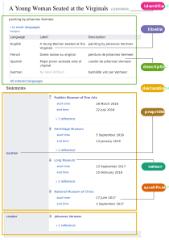
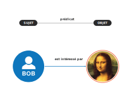
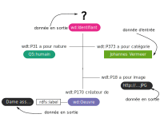
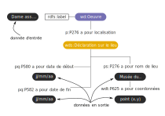
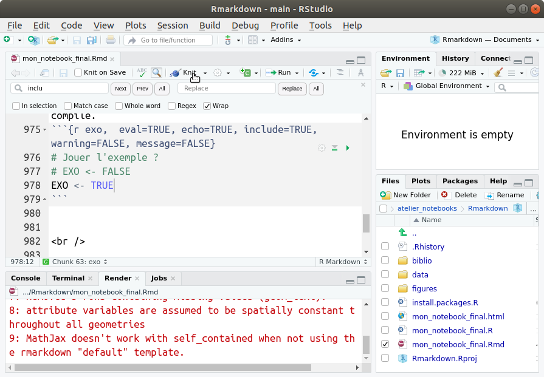

```{r setup, include=FALSE}

## Global options
knitr::opts_chunk$set(echo=TRUE,
        	            cache=FALSE,
                      prompt=FALSE,
                      comment=NA,
                      message=FALSE,
                      warning=FALSE,
                      class.source="bg-info",
                      class.output="bg-warning")


```


> L'objectif de ce document computationnel (notebook R ou Rmarkdown) est de partager une analyse exploratoire de données^[une donnée est un objet relationnel, voir par exemple et de manière non-exhaustive, [le séminaire 2019 de l'ENSSIB](https://www.enssib.fr/seminaire-les-donnees-mille-temps-01){target="_blank"} ou encore l'article de Louis Quéré [Au juste, qu'est-ce que l'information ?](https://www.persee.fr/doc/reso_0751-7971_2000_num_18_100_2227){target="_blank"}], suffisamment détaillée pour être intelligible pour un large public et reproductible à l'identique sur sa machine. 
>
> Le notebook permet ainsi de présenter clairement, étape par étape, toute une chaîne de traitements de données réalisée avec R à un public qui ne maîtrise pas forcément ce langage. 
>
> Un certain nombre de métadonnées^[une métadonnée est une donnée sur une donnée] associées au notebook (information de session, liste et version de packages, bibliographie, glossaire, difficultés rencontrées...) fournit les informations nécessaires à la réutilisation d'une partie du code par les lecteurs et lectrices, voire de reproduire ce document et l'exécuter en local sur son propre ordinateur.

# Introduction {-}

Nous présentons dans ce document une chaîne complète de traitements de données Wikidata, de leur collecte à leur visualisation graphique. 
Le processus exploratoire des données, parfois itératif, a été conservé. Cela permet de bien comprendre l'approche réflexive des auteurs et autrices et de retranscrire au mieux la démarche scientifique exploratoire.

Dans ce notebook, les données utilisées sont celles disponibles et mises en jour sur Wikidata. Elles sont structurées sous une forme décrite sommairement ci-dessous (voir Fig. 1). Pour plus d'informations, il est possible de consulter l'[introduction à Wikidata](https://www.wikidata.org/wiki/Wikidata:Introduction/fr){target="_blank"} ou la [page Wikibase](https://www.mediawiki.org/wiki/Wikibase/Indexing/RDF_Dump_Format){target="_blank"} dédiée au format RDF du dépôt de données Wikidata.

```{r, out.width="70%", fig.cap="Fig.1 Diagramme d'une entité Wikidata avec les principaux termes utilisés (Source : [Wikidata](https://www.wikidata.org/wiki/Wikidata:Introduction){target='_blank'})", fig.align = 'center', echo=FALSE, purl=FALSE}

```

Les principaux termes utilisés figurent dans le [glossaire](#endnotes) du notebook (pour aller plus loin, le [glossaire de Wikidata](https://www.wikidata.org/wiki/Wikidata:Glossary/fr){target="_blank"}).

L'idée de départ qui conduit à la démarche proposée, est d'accéder à un dépôt de données de sorte à interroger une ou des modalités possibles pour tracer une ou des *trajectoires*^[voir par exemple, *Construction de typologies de trajectoires*, Nicolas Robette, [Tuto@Mate#41](https://mate-shs.cnrs.fr/actions/tutomate/tuto41_analyse_trajectoires_nicolas_robette/)]. Compte-tenu du formalisme et de la spécificité des données non supervisées de Wikidata, l'objet choisi pour l'étude est une peinture sur son support physique inséré dans un cadre, susceptible d'être exposée au sein d'un musée ou d'une institution culturelle dans le monde. ([voir les données utilisées](#données-utilisées)).

<br />

# R, code source et packages
**Ce document computationnel (Notebook) peut être reproduit à l'identique sur un ordinateur**. **Pour cela il est nécessaire d'avoir installé R**. Il est nécessaire également d'installer deux *packages*[^1] (`knitr` et `rmdformats`).

[^1]: La bibliothèque des fonctions internes de R est divisée en ensembles de fonctions et de jeux de données apparentés nommés *packages* (terme que l’équipe de traduction française de R a choisi de conserver tel quel) [(Goulet, 2016, p.62)](https://cran.r-project.org/doc/contrib/Goulet_introduction_programmation_R.pdf){target="_blank"}

## Installer R et Rstudio
Seul R est indispensable pour reproduire ce document. Mais il est fortement conseillé d'installer également l'IDE Rstudio qui facilite considérablement la pratique de R et la production de documents au format Rmarkdown.  
R et Rstudio s'installent comme n'importe quel autre logiciel :  
- [Téléchargez R](https://cran.r-project.org/){target="_blank"}, mis à disposition sur le CRAN ;  
- [Télécharger Rstudio](https://www.rstudio.com/products/rstudio/download/){target="_blank"} (Rstudio Desktop Free version) sur le site de l'entreprise.    
<br />

## Packages associés au Notebook, `knitr` & `rmdformats`
Deux *packages* sont nécessaires pour reproduire ce document à l'identique :  
- `knitr` : offre des outils pour la génération de rapports dynamiques (*literate programming*) ;  
- `rmdformats` : met à disposition le modèle (*template*) de mise en page HTML utilisé (adapté de *readthedown*^[pour les différents formats disponibles, voir par exemple la [page rmdformats](https://cran.r-project.org/web/packages/rmdformats/readme/README.html) du dépôt Cran-R-project.]).

**Installez-les, en exécutant cette ligne de commande dans la console R :**
```{r install0, eval=FALSE, echo=TRUE, message=FALSE, warning=FALSE}
install.packages("knitr", "rmdformats")
```

<div class="alert alert-danger" role="alert">

En fonction du système d'exploitation utilisé, il peut-être nécessaire d'installer des logiciels ou des bibliothèques logicielles dont certains *packages* dépendent.

<b>Sur Windows, l'exécution d'un fichier au format Rmarkdown (avec `knitr`) nécessite l'installation du logiciel [<b>Pandoc</b>](https://pandoc.org/){target="_blank"}</b>^[Ce dernier permet de convertir un fichier d'un format donné à un autre (.md vers .html par exemple).].
</div>
<br />

## Code source du document

Pour les utilisateurs et les utilisatrices du [logiciel de gestion de versions](https://fr.wikipedia.org/wiki/Logiciel_de_gestion_de_versions){target="_blank"} Git, le dépôt du code source est accessible ici :   

<p><center>
[](https://gitlab.huma-num.fr/gt-notebook/workshop/workshop_3_decembre_2021/atelier_notebooks/-/tree/main/Rmarkdown)
</center>
</p>


Sinon, il est possible de récupérer le code source de ce document Rmarkdown en cliquant sur le lien ci-dessous. 

<p class="center">[<span style="font-size: 230%;" class="glyphicon glyphicon-download-alt"></span> <br /> Télécharger le code source](https://gitlab.huma-num.fr/gt-notebook/workshop/workshop_3_decembre_2021/atelier_notebooks/-/archive/main/atelier_notebooks-main.zip?path=Rmarkdown)</p>

Décompresser le dossier, puis double-cliquer sur le fichier projet ***Rmarkdown.Rproj*** pour ouvrir le projet dans l'IDE Rstudio.
<br />

## Packages nécessaires au traitement des données et à la représentation d'une *trajectoire*

Les packages utilisés pour l'exploration de données présentée dans ce document sont :

- `WikidataQueryServiceR`: fournit une interface de programmation (API client) pour le [*Wikidata Query Service*](https://query.wikidata.org/){target="_blank"} ;   
- `rnaturalearth`: met à disposition les données cartographiques de [*Natural Earth*](https://www.naturalearthdata.com/){target="_blank"} ;  
- `sf`: permet la gestion et la manipulation (géotraitement) de données géographiques ;  
- `mapview`: permet de produire facilement des cartes interactives (leaflet) ;  
- `tmap` : permet de produire de cartes thématiques ; 
- `ggplot2`: permet de produire des graphiques, basés sur la [grammaire graphique théorisée par *Leland Wilkinson*](https://www.cultura.com/the-grammar-of-graphics-9780387987743.html){target="_blank"}  ;  
- `patchwork`: permet de combiner facilement plusieurs graphiques `ggplot2` ;  
- `jpeg`: permet d'importer, enregistrer et afficher des images matricielles (format bitmap) ;
- `DT`: fournit une mise en forme dynamique (HTML) de tableaux de données (bibliothèque javascript [DataTables](https://datatables.net/){target="_blank"}).

**Ces *packages* seront automatiquement installés en exécutant** (***knitant***) **le fichier source** (***mon_notebook_final.rmd***).

```{r install1, eval=FALSE, echo=TRUE, include=TRUE, message=FALSE, warning=FALSE}

# Packages nécessaires
mes_packages <- c("WikidataQueryServiceR",
                  "rnaturalearth",
                  "sf",
                  "mapview",
                  "tmap",
                  "ggplot2",
                  "patchwork",
                  "jpeg", 
                  "DT")

# Packages qui n'ont pas été encore installés
mes_packages_no_install <- mes_packages[!(mes_packages %in% installed.packages()[,"Package"])]

# Installation des packages manquants
install.packages(mes_packages_no_install)

```

<div class="alert alert-danger" role="alert">

<b>Sur Linux, il est parfois nécessaire d'installer [<b>GDAL</b>](https://gdal.org/){target="_blank"}</b> (bibliothèque permettant de lire et de traiter un très grand nombre de formats de données spatiales) <b>pour utiliser le package `sf`</b>.
</div>   

<div class="alert alert-success" role="alert">

<b>L'ensemble des informations du système et des versions de *packages* utilisés est fournit en</b> <a href="#info-session"><b>fin de document</b></a>.
</div>    
   

<br />

# Données utilisées

## Wikimédia & Wikiproject

Wikimédia fournit l'infrastructure nécessaire à la connaissance libre (source : [Wikimedia](https://wikimediafoundation.org/fr/){target="_blank"}). Les projets de la fondation sont déclinés en catégories, par exemple, les ouvrages de références comme Wikipédia ou Wiktionnaire, les médiathèques comme Wikimédia Commons, ou encore des guides ou technologies, comme Wikidata.

Les contributeurs et contributrices au projet global Wikidata sont organisées en [projets thématiques](https://www.wikidata.org/wiki/Wikidata:WikiProjects){target="_blank"} qui se ramifient en sous groupes (par exemple, le [groupe qui s'intéresse aux peintures](https://www.wikidata.org/wiki/Wikidata:WikiProject_sum_of_all_paintings){target="_blank"}). 

Dans le cas de ce notebook, on s’intéresse aux arts visuels et notamment une partie des données qui ont permis de construire le portail [Wikiart](https://www.wikiart.org/fr){target="_blank"}.    

<br />

## Wikidata & RDF

Wikidata est une base de connaissances libre éditée de manière collaborative et hébergée par la Wikimedia Foundation. Son contenu étant placé sous licence CC01, elle permet de centraliser les données utilisées par différents projets Wikimedia (source : [Wikipédia](https://fr.wikipedia.org/wiki/Wikidata){target="_blank"}). **Les informations saisies dans Wikidata sont des données “brutes” multilingues** ***non-supervisées***.

```{r, out.width="75%", fig.cap="Fig.2 Données Wikipédia (DBpédia) vs données Wikidata (source : [Wikidata-Basics/Wikidata Hackathon event for the Festival of Creative Learning 2018](https://thinking.is.ed.ac.uk/wikidata-basics/faq-and-further-reading/){target='_blank'})",  fig.align = 'center',  echo=FALSE, purl = FALSE }

knitr::include_graphics('figures/wikidata_vs_dbpedia.png')
```

La première étape est de configurer le notebook pour permettre l'interrogation de données *à distance* au sein d'un dépôt de données accessibles dans un cadre de description standard du web sémantique. 
En particulier, ces données sont accessibles sous forme de graphes de données associées aux objets. 

```{r, out.width="75%", fig.cap="Fig.3 Exemple de graphe de triplets (source : [W3C](https://www.w3.org/TR/rdf11-primer/){target='_blank'})",  fig.align = 'center',  echo=FALSE, purl = FALSE }

knitr::include_graphics('figures/example-graph.jpg')
```

L'unité de construction d'un graphe est un triplet du cadre de description des ressources du W3C (RDF), et adopte une forme très générale **sujet - prédicat - objet** traduisant, par exemple, en données structurées l'**assertion ou déclaration "Bob est intéressé par Mona Lisa"** :

```{r, out.width="75%",  fig.cap="Fig.4 Composantes génériques d'un triplet RDF", fig.align = 'center',  echo=FALSE, purl = FALSE }

```

## Données liées utilisées


Dans ce notebook, les peintures sont des objets décrits par leurs relations aux données liées instanciant certaines classes et propriétés de Wikidata utiles à l'étude de cas proposée. Schématiquement, les peintres, peintures et lieux d'exposition sont modélisées selon la représentation schématique ci-dessous, comprenant des entités liées entre elles et mobilisant une syntaxe spécifique avec des préfixes^[voir notamment, les préfixes wikidata [ici](https://www.wikidata.org/wiki/EntitySchema:E49){target="_blank"}]. 

```{r, out.width="75%", fig.cap="Fig.5 Classes et propriétés générales de Wikidata mobilisées dans l'étude de cas proposée", fig.align = 'center', echo=FALSE, purl = FALSE }

```


Afin de disposer des données relatives à une œuvre visuelle, son auteur et sa localisation, plusieurs données associées à l'artiste, à l'œuvre ou aux déclarations (*statements*) sur celle-ci sont nécessaires, notamment :   

- **L'auteur (ici le peintre)** est une entité (préfixe `wd`) ayant pour propriété directe (préfixe `wdt`) :
  - d'être une instance de Wikidata ([P31](https://www.wikidata.org/wiki/Property:P31){target="_blank"}) de nature une entité humaine ([Q5](https://www.wikidata.org/wiki/Q5));
  - ayant pour catégorie commune ([P373](https://www.wikidata.org/wiki/Property:P373){target="_blank"}) le libellé "Johannes Vermeer";
  - et d'être le créateur ([P170](https://www.wikidata.org/wiki/Property:P170){target="_blank"}) d'œuvres. 
  
   
- **La désignation de l'œuvre elle-même**, pas le biais de l'entité (préfixe `wd`) associée à l'identifiant qui la représente, par exemple `wd:Q4660880` pour l'œuvre dénommée [A Young Woman Seated at the Virginals](https://www.wikidata.org/wiki/Q4660880){target="_blank"} du peintre Johannes Vermeer.

- **La localisation de l'entité au moyen de la propriété ([P276](https://www.wikidata.org/wiki/Property:P276){target="_blank"})**, permettant l'accès aux assertions ou déclarations de localisation de l'œuvre dans un lieu (géographique & institutionnel) et un espace de temps (intervalle) : `wdt:P276`

- **Les coordonnées de la localisation associée à l'œuvre** au moyen de la propriété directe ([P625](https://www.wikidata.org/wiki/Property:P625){target="_blank"}).

```{r, out.width="75%", fig.cap="Fig.6 Classes et propriétés spécifiques de Wikidata mobilisées dans le cas d'une déclaration (statement)", fig.align = 'center', echo=FALSE, purl = FALSE }

```

# Interroger Wikidata

Le package `WikidataQueryServiceR` fournit une API client (i.e. interface de programmation) pour interroger le [*Wikidata Query Service*](https://query.wikidata.org/){target="_blank"} directement via R.

Une première étape est de permettre à l'utilisateur ou utilisatrice du notebook d'identifier l'artiste qu'il ou elle va choisir. On s'intéresse, dans cette étude de cas, aux œuvres de **Johannes Vermeer**. Il sera possible de *jouer* en fin d'exercice pour obtenir les œuvres d'autres peintres ou artistes.

Afin de requêter les données via le package `WikidataQueryServiceR`, il est nécessaire de construire un certain type de requête (ici, en [langage SPARQL](https://fr.wikipedia.org/wiki/SPARQL){target="_blank"}), et de l'exécuter.

<br />

## Première requête SPARQL

Par exemple, la requête ci-dessous demande l'identifiant d'une entité ayant pour propriété (P31) d'appartenir à la classe des êtres humains (Q5) qui entre dans la catégorie (P373) Johannes Vermeer et dont on demande une image ([P18](https://www.wikidata.org/wiki/Property:P18){target="_blank"}).


```{r sparql1,  eval=TRUE, echo=TRUE, include=TRUE, warning=FALSE, message=FALSE}
# Package API pour le 'wiki data service'
library(WikidataQueryServiceR)

# Requête SPARQL 
# Recherche de l'artiste nommé 'Johannes Vermeer' et d'une illustration associée
data1 <- query_wikidata('
          SELECT ?identifiant ?image  WHERE {
              SERVICE wikibase:label { bd:serviceParam wikibase:language "[AUTO_LANGUAGE],en". }
              ?identifiant wdt:P31 wd:Q5 ; wdt:P373 "Johannes Vermeer" .
              ?identifiant wdt:P18 ?image .
              }  
')
```

**Affichage des données récupérées :**
```{r displaydata,  eval=TRUE, echo=TRUE, class.source = "fold-hide"}
# Affichage dynamique de la table
library(DT)
datatable(data1)
```

**Deux URL sont récupérées :**   
- Le lien vers la page wikidata du peintre Johannes Vermeer : [data1$identifiant](http://www.wikidata.org/entity/Q41264){target="_blank"}         
- Le lien vers l'image associée à ce peintre dans wikidata : [data1$image](http://commons.wikimedia.org/wiki/Special:FilePath/Cropped%20version%20of%20Jan%20Vermeer%20van%20Delft%20002.jpg){target="_blank"}   

<br />

**Nous sauvegardons de l'image de l'artiste :**
```{r datafolder, eval=TRUE, echo=TRUE, include=TRUE, warning=FALSE}
# Création des sous-répertoires 'data' et 'data/image'
dir.create("data")
dir.create("data/images")
```

```{r,  eval=TRUE, echo=TRUE, include=TRUE, warning=FALSE, message=FALSE}
# Téléchargement et sauvegarde de l'image sur sa machine
download.file(url = data1$image, 
              destfile = 'data/images/portrait_artiste.jpg', 
              mode = 'wb')
```

```{r, echo=FALSE, out.width="35%", fig.cap=paste0("Fig.7 Image wikidata pour le peintre Johannes Vermeer (ID = ",gsub(pattern = "http://www.wikidata.org/entity/", replacement = "" , x = data1$identifiant),")"),  fig.align = 'center', purl = FALSE }

knitr::include_graphics('data/images/portrait_artiste.jpg')
```

## Seconde requête SPARQL

En second lieu, on propose de lister l'ensemble des œuvres de l'artiste choisi (dont l'identifiant ici est ([Q41264](https://www.wikidata.org/wiki/Q41264){target="_blank"}) pour Vermeer). 


La requête ci-dessous demande l'identifiant d'une entité - une œuvre, ayant pour créateur (P170) l'artiste choisi (Q41264) ; chaque œuvre ayant la propriété d'être exposée dans un lieu donné (P276), associé à une localisation (P625) (coordonnées géographiques).


```{r sparql2,  eval=TRUE, echo=TRUE, include=TRUE, warning=FALSE, message=FALSE}

# Requête SPARQL 
# Recherche de toutes les œuvres de Johannes Vermeer et de leurs localisations (musée)
data2 <- query_wikidata('
              SELECT ?oeuvreLabel ?museeLabel ?coord 
                WHERE { SERVICE wikibase:label { bd:serviceParam wikibase:language "[AUTO_LANGUAGE],en". } 
                ?oeuvre wdt:P170 wd:Q41264 .
                OPTIONAL {?oeuvre p:P276 ?loc . ?loc ps:P276 ?musee . ?musee wdt:P625 ?coord} . 
                }
        ')
``` 

**Données récupérées :**
```{r displaydata3,  eval=TRUE, echo=TRUE, class.source = "fold-hide"}
# Affichage de la table
datatable(data2)
```

On constate que certaines œuvres (par exemple, *View of Delft*) ont plusieurs localisations, d'autres (ex :*Mistress and Maid*) aucune. 

Pourquoi ? 

En explorant les données obtenues, plusieurs localisations semblent possibles pour une même œuvre. Ce constat nécessite d'entrer plus en détail dans les déclarations (*statements*) renseignées pour la donnée, notamment la localisation de l'œuvre au cours du temps entre divers musées ou institutions culturelles de divers pays, en utilisant les valeurs et qualificatifs (*qualifiers*) associés aux propriétés figurant dans les déclarations (voir Figure 1.). 

Par exemple, le cas de l’œuvre de Vermeer intitulée *A Young Woman Seated at the Virginals* ([http://www.wikidata.org/entity/Q4660880](http://www.wikidata.org/entity/Q4660880){target="_blank"}) semble être l'œuvre (ID Wikidata : **Q4660880**) de Vermeer qui a le plus *voyagé*, c'est à dire qui possède le plus grand nombre de valeurs associées à la propriété *location* dans les déclarations.

<br />

## Troisième requête SPARQL

**Il s'agit maintenant de connaître les modalités de circulation de l'œuvre dans les lieux d'exposition, musées et institutions**. Nous allons donc requêter les différents lieux d'exposition (P276), leurs noms, ainsi que leurs coordonnées géographiques (P625) et les dates de début et de fin pour lesquelles l'œuvre ([*A Young Woman Seated at the Virginals*](http://www.wikidata.org/entity/Q4660880){target="_blank"}) et le lieu sont liées (P580 & P582), voir notamment la [figure 5 ci-dessus](#données-liées-utilisées).


```{r sparql3,  eval=TRUE, echo=TRUE, include=TRUE, warning=FALSE, message=FALSE}

# Requête SPARQL 
# Recherche de toutes les localisations + dates associées à 
# l'œuvre "A Young Woman Seated at the Virginals" de Johannes Vermeer
data <- query_wikidata('
          SELECT ?image ?nomLabel ?dated ?datef ?coord WHERE {
              SERVICE wikibase:label { bd:serviceParam wikibase:language "[AUTO_LANGUAGE],en". }
              wd:Q4660880 p:P276 ?location ; wdt:P18 ?image .
              ?location ps:P276 ?nom .
              ?location pq:P580 ?dated .
              ?location pq:P582 ?datef .
              ?nom wdt:P625 ?coord .
              }
        ')

```

**Données récupérées :**
```{r displaydata1,  eval=TRUE, echo=TRUE}
# Affichage de la table
datatable(data)
```

**Enregistrement et (ré)import des données :**
```{r writedata,  eval=TRUE, echo=TRUE, include=TRUE}
# Enregistrement des données en local
write.csv(x = data, file = "data/data.csv", row.names = FALSE)

# Import du fichier de données enregistré
data <- read.csv("data/data.csv", row.names = NULL)
```

**Enregistrement de l'image de l'œuvre sur sa machine :**
```{r,  eval=TRUE, echo=TRUE, include=TRUE, warning=FALSE, message=FALSE}
# Téléchargement et sauvegarde en local de l'image
download.file(url = data$image[1], 
              destfile = 'data/images/Q4660880.jpg', 
              mode = 'wb')
```

```{r, echo=FALSE, out.width="50%", fig.cap="Fig.8 'A Young Woman Seated at the Virginals' de Johannes Vermeer (1670)", fig.align = 'center', purl = FALSE }

```


<br />


# Pré-traitement des données

Nous avons exécuté trois requêtes SPARQL, afin de récupérer respectivement :   

- **1. L'identifiant et l'image associés à Johannes Vermeer** dans wikidata (data1)    
- **2. Les œuvres du peintre Johannes Vermeer et leur localisation** (musée + coordonnées) (data2)   
- **3. L'ensemble des localisations (musée + coordonnées) de l’œuvre** *A Young Woman Seated at the Virginals* de Johannes Vermeer au cours du temps (data)    


**Ces données, non-supervisées, nécessite d'être contrôlées et nettoyées avant d'être exploiter.**

## Les oeuvvres de Vermeer

**Nettoyage des données issues de la seconde requête SPARQL (data2)**, qui liste l'ensemble des œuvres de Vermeer et leur localisation (nom du musée + coordonnées géographiques), selon Wikidata.

### Nettoyage des données

Comme vu précédemment (cf. [partie 3.2](#seconde-requête-sparql)), **il y a parfois plusieurs et parfois aucune localisations associées aux œuvres.** 

Après vérification, pour chaque œuvre présentant plusieurs coordonnées, la dernière localisation qui apparaît dans le tableau de données récupéré est également la dernière localisation renseignée dans Wikidata... **Nous supprimons donc tous les doublons en ne gardant que le premier item qui apparaît dans la table de données.**
```{r,  eval=TRUE, echo=TRUE, include=TRUE}
# Détection/Suppression doublon(s)
data2 <- data2[!duplicated(data2$oeuvreLabel), ]
```

**Nous supprimons également toutes les œuvres pour lesquelles aucune localisation n'est renseignée.**
```{r,  eval=TRUE, echo=TRUE, include=TRUE}
# Suppression NA
data2 <- data2[!is.na(data2$coord), ]
```

Affichage des données 'nettoyées' :
```{r,  eval=TRUE, echo=TRUE, include=TRUE}
datatable(data2)
```

<br />

### Regroupement par musée

Les localisations renseignées sont celles des musées qui exposent les œuvres pendant une durée donnée. Plusieurs œuvres présentent plusieurs fois la même localisation dans Wikidata. 

Certaines œuvres semblent exposées (dernière localisation) dans les mêmes musées (même nom et mêmes coordonnées). Nous effectuons donc un regroupement des œuvres par musée 'museeLabel', en calculant le nombre d'œuvres de Vermeer que institution expose.
```{r,  eval=TRUE, echo=TRUE, include=TRUE}
# Regroupement - Calcul du nombre œuvres par musée
nb_oeuvre_by_musee <- aggregate(oeuvreLabel ~ coord + museeLabel, data = data2, FUN = length)

# Affichage du résultat
datatable(nb_oeuvre_by_musee)
```

<br />

### Géoréférencement

A partir de la variable 'coord', il est simple de transformer ce tableau de données en couche géographique, où les individus/entités (musées) sont précisément localisés dans l'espace. **Nous réalisons cela en deux étapes :**

**1. Création des colonnes 'long' et 'lat' à partir de la colonne 'coord'.**
```{r,  eval=TRUE, echo=TRUE, include=TRUE}
# Suppression des chaînes de caractères "Point(" et ")"
nb_oeuvre_by_musee$coord <- gsub(pattern = 'Point\\(', replacement = '', nb_oeuvre_by_musee$coord)
nb_oeuvre_by_musee$coord <- gsub(pattern = '\\)', replacement = '', nb_oeuvre_by_musee$coord)

# Séparation longitude et latitude en deux colonnes
out <- strsplit(nb_oeuvre_by_musee$coord, split = ' ')
musee_geo <- cbind(nb_oeuvre_by_musee, do.call(rbind, out))

# Renommage de colonnes créées
colnames(musee_geo)[4:5] <- c('long', 'lat')
```

La table de données comporte dorénavant deux nouvelles colonnes ('long' et 'lat').

```{r,  eval=TRUE, echo=FALSE, include=TRUE}
datatable(musee_geo)
```

**2. Conversion du tableau en couche géographique, à partir des variables 'long' et 'lat'.**
```{r,  eval=TRUE, echo=TRUE, include=TRUE, message=FALSE}
# Package pour la gestion de données géographique
library(sf)
# Géoréférencement (tableau de données -> couche géographique)
musee_geo <- st_as_sf(musee_geo, coords = c("long", "lat"), crs = 4326)
```

**3. Affichage de la couche géographique créée.** 

Il est très facile d'afficher les points crées (musées) sur une carte interactive, en utilisant la bibliothèque `mapview`. Cela permet en autre de vérifier la qualité des données et du géoréférencement effectué.

```{r,  eval=TRUE, echo=TRUE, include=TRUE, warning=FALSE, message=FALSE}
# Package pour la cartographie interactive
library(mapview)
# Affichage de la couche géographique des musées
mapview(musee_geo)

```

<br />


## 'Dame assise au virginal'

Nettoyage des données issues de la troisième requête SPARQL (data), qui liste l'ensemble des localisations de l'œuvre de Johannes Vermeer *A Young Woman Seated at the Virginals* (ou *Dame assise au virginal* en français) au cours du temps.

### Nettoyage des données

Comme on peut le vérifier dans le tableau de données récupéré (cf. [partie 3.3](#troisième-requête-sparql)), il semble y avoir des doublons dû à la présence de deux localisation renseignées pour le musée italien : [Scuderie del Quirinale](https://www.wikidata.org/wiki/Q26840128){target="_blank"}. Seules les coordonnées différé très légèrement (quelques mètres...).


Nous supprimons les doublons en utilisant la date d'arrivée dans les musées. Par définition, une œuvre ne peut pas être à deux endroits différents en même temps !
```{r,  eval=TRUE, echo=TRUE, include=TRUE}
# Détection/Suppression doublon(s)
data <- data[!duplicated(data$dated), ]

# Une ligne a été supprimée
nrow(data)
```


<br />

### Géoréférencement

Comme pour le tableau de données précédant (data2), nous géoréférençons les musées concernées à partir de la variable 'coord' afin de créer une couche géographique.

```{r,  eval=TRUE, echo=TRUE, include=TRUE}
data$coord
```

**1. Création des colonnes 'long' et 'lat' à partir de la colonne 'coord'.**
```{r,  eval=TRUE, echo=TRUE, include=TRUE}
# Suppression des chaînes de caractères "Point(" et ")"
data$coord <- gsub(pattern = 'Point\\(', replacement = '', data$coord)
data$coord <- gsub(pattern = '\\)', replacement = '', data$coord)

# Séparation longitude et latitude en deux colonnes
out <- strsplit(data$coord, split = ' ')
data_geo <- cbind(data[-5], do.call(rbind, out))

# Renommage de colonnes créées
colnames(data_geo)[5:6] <- c('long', 'lat')
```

```{r,  eval=TRUE, echo=FALSE, include=TRUE}
# Affichage des deux nouvelles colonnes créées.
datatable(data_geo[2:6])
```

**2. Conversion du tableau en couche géographique, à partir des variables 'long' et 'lat'.**
```{r,  eval=TRUE, echo=TRUE, include=TRUE, message=FALSE}
# Géoréférencement des musées
data_geo <- st_as_sf(data_geo, coords = c("long", "lat"), crs = 4326)

# Affichage de la couche géographique des musées
mapview(data_geo)
```

Les données semblent correctement géoréférencées... Nous pouvons alors **démarrer l'exploration spatiale des données** !

<br />


# Exploration spatiale


## Les œuvres de Vermeer

### Cartographie thématique

À partir des données récupérées et pré-traitées, **nous pouvons réaliser une carte en symboles proportionnels qui représente le nombre d'œuvres localisées par musée**.
```{r,  eval=TRUE, echo=TRUE, include=TRUE, warning=FALSE, message=FALSE}

# Package pour la cartographie thématique
library(tmap)

# Mode cartographie interactive
tmap_mode(mode = "view")

# Carte thématique
tm_basemap() +
tm_shape(musee_geo) +
tm_symbols(size="oeuvreLabel", 
           scale = 4,
           col="red3",
           border.col="white", 
           alpha =0.5,
           border.lwd=0.1,
           border.alpha=0.5,
           title.size = "Nb d'œuvres",
           id = "museeLabel",
           popup.vars=c("Nombre d'œuvres"="oeuvreLabel"))


```
<center>
Répartition des peintures de Johannes Vermeer par musée, selon Wikidata
</center>

<br />


### Enrichissement


Au vue de la carte précédente, **il pourrait être intéressant de résumer la répartition des œuvres de Johannes Vermeer par pays**. Pour cela, **il est nécessaire d'enrichir les données en ajoutant pour chaque musée, le pays dans lequel il se situe**. Plusieurs étapes sont nécessaires :

**1. Téléchargement d'un fond de carte pays**     
```{r,  eval=FALSE, echo=TRUE, warning=FALSE, message=FALSE}
# Package qui permet d'accéder aux données Natural Earth
library(rnaturalearth)

# Téléchargement d'un fond de carte pays
world <- ne_download(scale = "small",
                     type = "countries", 
                     category = "cultural", 
                     destdir = "data/world",
                     load = TRUE,  
                     returnclass = "sf")
```

```{r,  eval=TRUE, echo=FALSE, warning=FALSE, message=FALSE}
# Pour le charger de nouveau :
world <- st_read("data/world/ne_110m_admin_0_countries.shp", quiet = TRUE )
```

**Affichage du fond de carte récupéré :**
```{r,  eval=TRUE, echo=TRUE, include=TRUE, message = FALSE}
# Affichage du fond de carte récupéré 
plot(st_geometry(world))
```

**2. Modification de la projection cartographique utilisée (WGS84 vers Robinson)**
```{r,  eval=TRUE, echo=TRUE, include=TRUE, warning=FALSE, message=FALSE}
# Reprojection du fond de carte pays (polygones)
world <- st_transform(x = world, crs = "+proj=moll", use_gdal = FALSE)

# Reprojection de la couche géographique (points)
musee_geo <- st_transform(musee_geo, crs = st_crs(world))
```


**3. Jointure spatiale points/pays.**    

Nous réalisons ensuite ce que l'on appelle une [**jointure spatiale**](https://www.emse.fr/tice/uved/SIG/Glossaire/co/Jointure_spatiale.html){target="_blank"}, qui nous permet de récupérer pour chaque point (musée) le pays dans lequel il se situe. Pour cela la fonction `st_intersection` du package `sf`.
```{r,  eval=TRUE, echo=TRUE, include=TRUE, warning = FALSE}
# Jointure spatiale
# Récupération du code ISO3 des pays (uniquement)
musee_geo <-st_intersection(musee_geo, world[,"ADM0_A3"])
```

Le code ISO3 du pays a été récupéré pour chaque point (musée) :
```{r,  eval=TRUE, echo=FALSE, include=TRUE}
datatable(st_drop_geometry(musee_geo[2:4]))
```

<br />

### Répartition par pays


**1. Regroupement des œuvres par pays**     
Nous calculons le nombre d'œuvres par pays.
```{r,  eval=TRUE, echo=TRUE, include=TRUE}
# Regroupement - Calcul du nombre œuvres par pays
nb_oeuvre_musee_geo <- aggregate(oeuvreLabel ~ ADM0_A3, data = musee_geo, FUN = sum)

```

**2. Représentation graphique**     
Nous pouvons alors construire un graphique représentant le nombre d'œuvres par pays.
```{r,  eval=TRUE, echo=TRUE, include=TRUE}
# Package de représentation graphique
library(ggplot2)

# Graphique en barre - Nombre d'œuvres par pays
ggplot(data = nb_oeuvre_musee_geo, aes(x = ADM0_A3, y = oeuvreLabel, fill=ADM0_A3) )  + 
  geom_bar(stat="identity") +
  ggtitle("Nombre d'œuvres de Johannes Vermeer par pays") +
  xlab("") + 
  ylab("") +
  scale_fill_brewer(palette="Set1") + 
  theme(legend.position = "none")

```

<br />


## 'Dame assise au virginal'

### Cartographie exploratoire

Nous réalisons de nouveau une carte interactive exploratoire, en améliorant la mise en page et l'affichage de variable dans des pop-up.
```{r,  eval=TRUE, echo=TRUE, include=TRUE, warning=FALSE, message=FALSE}

# Popup content
content <- paste0( "<br /><b>",  data_geo$nomLabel, 
                  "</b><br />Du ",data_geo$dated, 
                  "<br />Au ", data_geo$datef)
# Carte
mapview(data_geo, 
        zcol = "nomLabel", 
        col.regions = "red", 
        legend = FALSE,
        popup = content,
        map.types = "Esri.WorldImagery")

```

<br />

### Enrichissement

Comme effectué précédemment pour les musées hébergeant l'ensemble de œuvres de Johannes Vermeer, il pourrait être intéressant de résumer la trajectoire spatiale du tableau *A Young Woman Seated at the Virginals*, en comptabilisant le nombre d'expositions effectuées par pays. 

Nous enrichissons donc les données de la même façon que présenté dans la [partie 5.1.2](#enrichissement).

**1. Modification de la projection cartographique utilisée (WGS84 vers Robinson)**
```{r,  eval=TRUE, echo=TRUE, include=TRUE, warning = FALSE}
# Reprojection de la couche géographique (points)
data_geo <- st_transform(data_geo, crs = st_crs(world))
```

**2. Jointure spatiale points/pays**     

Nous souhaitons maintenant récupérer les pays qui ont abrités l'œuvre au cours du temps, en réalisant une **Jointure spatiale**. Nous utilisons pour cela la fonction `st_intersection` du package `sf`.
```{r,  eval=TRUE, echo=TRUE, include=TRUE, warning = FALSE}
# Jointure spatial
data_geo <-st_intersection(data_geo, world[,"ADM0_A3"])
```

Le code ISO3 du pays a bien été récupéré pour chaque point (musée).
```{r,  eval=TRUE, echo=FALSE, include=TRUE}
# Affichage du résultat
datatable(st_drop_geometry(data_geo[2:5]))
```

<br />

### Répartition par pays


```{r,  eval=TRUE, echo=TRUE, include=TRUE}
# Package de représentation graphique
library(ggplot2)

# Graphique en barre - Nombre d'exposition de l'œuvre par pays
ggplot(data = data_geo, aes(factor(ADM0_A3), fill=factor(ADM0_A3)) ) + 
  geom_bar() +
  ggtitle("Nombre d'exposition de l'œuvre par pays") +
  xlab("") + 
  ylab("") +
  scale_fill_brewer(palette="Set1") + 
  theme(legend.position = "none")

```

<br />


# Exploration temporelle

Après avoir exploré la dimension spatiale des données récupérées, **nous nous intéressons maintenant à la dimension temporelle** des données portant sur le tableau *A Young Woman Seated at the Virginals*, et sur ses dates d'exposition dans différents musées.

Il nous semble que la meilleure représentation de ces données spatio-temporelles (lieu + date) n'est pas forcément un carte. **La construction d'un graphique s'apparentant à une frise chronologique nous paraît plus efficace. Pour cela, une série de pré-traitement des données est nécessaire**.

## Préparation des données

**1. Modification du format de stockage des dates (*string* to *date*) dans le tableau 'data_geo'**
```{r,  eval=TRUE, echo=TRUE, include=TRUE}
# Format date
data_geo$datef <- as.Date(data_geo$datef)
data_geo$dated <- as.Date(data_geo$dated)

```

**2. Tri du tableau en fonction de la date ('dated') d'arrivée dans chaque musée.**
```{r,  eval=TRUE, echo=TRUE, include=TRUE}
data_geo <- data_geo[order(data_geo$dated, decreasing = FALSE),]
```

**3. Ajout d'un ID pour chaque ligne du tableau**
```{r,  eval=TRUE, echo=TRUE, include=TRUE}
data_geo$ID <- 1:nrow(data_geo)
```

**4. Tri d'ordre d'apparition des modalités pour les variables 'nomLabel' et 'ADM0_A3'**
```{r,  eval=TRUE, echo=TRUE, include=TRUE}

# liste unique musée
musee <- unique(data_geo$nomLabel)
data_geo$nomLabel <- ordered(as.factor(data_geo$nomLabel), levels = musee)

# liste unique pays
countries <- unique(data_geo$ADM0_A3)
data_geo$ADM0_A3 <- ordered(as.factor(data_geo$ADM0_A3), levels = countries)
```

**5. Création d'une nouvelle colonne avec les noms des musées qui n'apparaissent qu'une fois**.
```{r,  eval=TRUE, echo=TRUE, include=TRUE}
# Label unique pour les pays
museum_label <- data_geo[!duplicated(data_geo$nomLabel),]
data_geo <- merge(data_geo, st_drop_geometry(museum_label[,c("ID","nomLabel")]), by="ID", all.x=TRUE)

```

**Le tableau de données après 'traitement' :**
```{r,  eval=TRUE, echo=FALSE}
datatable(data_geo)
```

<br />

## Frise chronologique

**Pour construire notre frise chronologique, nous utilisons la bibliothèque de référence `ggplot2`**. 


<br />

### Graphique de base

Nous commençons par définir les variables utilisées pour l'axe des abscisses (x), des ordonnées (y) et pour la couleur des individus (musées) :

- X = **dated** (date d'arrivée dans le musée)     
- y = **nomLabel.x** (nom du musée)   
- color = **ADM0_A3** (couleur en fonction du pays d'appartenance)     

```{r,  eval=TRUE, echo=TRUE, include=TRUE}

ggplot(data_geo, aes(x = dated, y = nomLabel.x, color = ADM0_A3)) 

```

La bibliothèque `ggplot2` fonctionne avec une syntaxe particulière (basée sur la [grammaire graphique](https://www.cultura.com/the-grammar-of-graphics-9780387987743.html){target="_blank"}). Il est possible d'ajouter, petit à petit, des éléments de mise en forme du graphique.

Nous ajoutons la géométrie, ici des segments, à représenter sur le graphique.
```{r,  eval=TRUE, echo=TRUE, include=TRUE}
# Construction de 'segments' entre la date d'arrivée (dated) et de départ (datef)
ggplot(data_geo, aes(x = dated, y = nomLabel.x, color = ADM0_A3)) +
  geom_segment(aes(xend = datef, yend = nomLabel.x, color =  ADM0_A3), size = 6)
```

Il est possible d'assigner le résultat graphique dans un objet :
```{r,  eval=TRUE, echo=TRUE, include=TRUE}

Mon_graph <- ggplot(data_geo, aes(x = dated, y = nomLabel.x, color = ADM0_A3)) +
               geom_segment(aes(xend = datef, yend = nomLabel.x, color =  ADM0_A3), size = 6)

```

<br />

### Mise en forme

La base de notre graphique a été réalisée. Nous pouvons maintenant travaillé sur sa mise en forme. Nous ajoutons des labels avec la fonction `geom_text()` et nous modifions la palette de couleur avec la fonction `scale_color_manual()`.

```{r,  eval=TRUE, echo=TRUE, include=TRUE, warning=FALSE}

Mon_graph <-  Mon_graph + 
              # Ajout d'une étiquette pour chaque segment représenté
              geom_text(aes(label = nomLabel.y, hjust =1.05), size = 3.5, show.legend = FALSE) + 
              # Modification de la palette de couleur (pays)
  scale_color_manual(values = c("#7570b3", "#e7298a", "#66a61e", "#e6ab02", "#a6761d","#1b9e77", "#d95f02"))

# Affichage du résultat
Mon_graph 

```


Nous poursuivant la mise en forme du graphique en :    

- modifiant l'axe des abscisse (intervalle des valeurs et étiquette à afficher),    
- ajoutant un titre et un sous-titre,    
- en paramétrant plusieurs éléments du 'thème' (repère, légende, axes, couleur de fond...).
```{r,  eval=TRUE, echo=TRUE, include=TRUE, warning=FALSE}
Mon_graph <- Mon_graph + 
              # Modification de l'axe des abscisse
              scale_x_date(date_labels = "%Y", date_breaks = "2 year", minor_breaks = "1 year",
                           limits = c(as.Date("1994-01-01"),as.Date("2019-01-13")) ) +
              # Ajout d'un titre et d'un sous-titre
              labs(title = "Le voyage d'un tableau de Johannes Vermeer",
                   subtitle = "Aux pays des musées, de 2001 à 2019") +
              # Paramétrage du 'thème'
              theme(panel.grid.major.y = element_blank(),
                    panel.grid.major.x = element_line(size = 0.2, colour = "#707073"),
                    panel.grid.minor.x = element_line(size = 0.2, linetype = 3, colour = "#707073"),
                    panel.border = element_blank(),
                    panel.background = element_blank(),
                    axis.text.y = element_blank(),
                    axis.text.x = element_text(size=8.5, colour = "#FFFFFF"),
                    axis.title = element_blank(),
                    rect = element_rect(fill = "#2a2a2b"),
                    legend.position =  c(.93, .27),
                    legend.key = element_rect(fill  = "#2a2a2b"),
                    legend.key.height = unit(0.1, 'cm'),
                    legend.background = element_rect(fill  = "#2a2a2b"),
                    legend.margin = margin(0.5,1,1,1),
                    legend.title = element_blank(),
                    legend.text = element_text(colour = "#FFFFFF",  size = 7),
                    title = element_text(colour = "#FFFFFF", hjust = 1, vjust = 0),
                    plot.margin=unit(c(1,1,0.5,1),"cm"))    


Mon_graph 
```

<br />

### Touche finale !

Pour terminer la mise en forme de notre frise chronologique, nous superposons l'image de l'œuvre analysée et son intitulé sur le graphique. Les bibliothèques `jpeg` et `patchwork` nous permettront d'importer puis d'insérer l'image du tableau sur la représentation graphique.

**1. Import de l'image du tableau dans R**
```{r,  eval=TRUE, echo=TRUE, include=TRUE}
# Gestion des images
library(jpeg)

path <- "data/images/Q4660880.jpg"

# Importer une image dans R
img <- readJPEG(path, native = TRUE)
```

**2. Superposition de l'image sur la représentation graphique**
```{r,  eval=TRUE, echo=TRUE, include=TRUE, warning=FALSE}
# Pour combiner graphiques et images
library(patchwork)

Mon_graph + 
  # Titre image
  annotate("text", x = as.Date("1997-03-01"), y = 7, colour = "#FFFFFF", size = 3.4, 
           label = "Young Woman Seated\nat a Virginal  (1670)") +
  # Insertion de l'image du tableau dans la représentation graphique
  inset_element(p = img, clip = TRUE, left = 0.04, right = 0.27, top = 0.95, bottom = 0.46) 
```

<br />


# A vous de jouer !

Notre exploration est terminée, mais nous vous proposons d'explorer vous-même les données wikidata en personnalisant le code qui suit. Cela vous permettra d'**explorer la répartition spatiale des œuvres de l'artiste peintre de votre choix. A vous de coder ! **

> **Étape 1** : Choisissez l'artiste peintre de votre choix et recherchez son identifiant wikidata. Pour cela, rendez-vous sur la page [Wikidata](https://www.wikidata.org/wiki/Wikidata:Main_Page){target="_blank"} et dans le champ de recherche, indiquez le nom de l'artiste peintre dont vous souhaitez localiser les œuvres. 
 
*Veillez à utiliser la saisie semi-automatique pour choisir l'identifiant correspondant à l'artiste et non à une catégorie commune ou tout autre entité utilisant cette catégorie (par exemple, un bâtiment etc.).*

<br />

> **Étape 2** : copiez-coller l'identifiant et le nom de l'artiste peintre choisi-e selon les recommandations ci-dessous. 

**Le code à modifier se situent à partir de la ligne 938 dans le fichier source du notebook :** ***mon_notebook_final.Rmd***.

```{r exo1,  eval=TRUE, echo=TRUE, include=TRUE, warning=FALSE, message=FALSE}

## Exemple Picasso

# Indiquez l'identifiant de l'artiste choisi-e entre ""
#ID <- "Q5593"
# Indiquez le nom de l'artiste choisi-e entre ""
#NOM <- "Pablo Picasso"

## Exemple Dali
# ID <- "Q5577"
# NOM <- "Salvador Dalí"

## Exemple Nandalal Bose (IN)
ID <- "Q3348980"
NOM <- "Nandalal Bose"

## Exemple Kalervo Palsa (FI)
# ID <- "Q320590"
# NOM <- "Kalervo Palsa"

## Exemple Edvard Munch
# ID <- "Q41406"
# NOM <- "Edvard Munch"

## Exemple Katsushika Hokusai
#ID <- "Q5586"
#NOM <- "Katsushika Hokusai"
```

<br />

> **Étape 3** : Par défaut, les lignes de codes (chunks) utilisées pour cet exercice ne sont pas affichées et ne s'éxécutes pas. Modifier la valeur bouléenne (`FALSE` par `TRUE`) assignée dans l'objet 'EXO'.

**Pour que les blocs de code deviennent actifs et s'exécutent lors de la compilation du Rmarkdown, modifiez la valeur de l'objet 'EXO', en lui assignant la valeur** ***TRUE***.

Le fait d'assigner la valeur booléenne `TRUE` à l'objet 'EXO' va rendre tous les chunks suivants actifs. Ils seront également visible dans le document compilé.
```{r exo,  eval=TRUE, echo=TRUE, include=TRUE, warning=FALSE, message=FALSE}
# Jouer l'exemple ?
#EXO <- FALSE
EXO <- TRUE
```


<br />

> **Étape 4** : Le plus dur est fait ! Il ne vous reste plus qu'a **'kniter' le document et visualiser les résultats.**

```{r, out.width="95%",  fig.cap="Fig.9 Cliquez sur 'Knit' en haut à gauche de l'éditeur", fig.align = 'center',  echo=FALSE, purl = FALSE }

```

**Une fois le document compilé, l'ensemble du code utilisé pour l'exercice sera affichés ci-dessous, tout comme les sorties graphiques !**

<br />


## Ma requête SPARQL 

**1. Construction de la requête SPARQL personnalisée**
```{r exo2,  eval=EXO, echo=EXO, include=TRUE, warning=FALSE, message=FALSE}

# query en fonction de l'ID
query <-  paste0("SELECT ?oeuvreLabel ?museeLabel ?coord WHERE { SERVICE wikibase:label { bd:serviceParam wikibase:language '[AUTO_LANGUAGE],en'. } ?oeuvre wdt:P170 wd:", ID, " . OPTIONAL {?oeuvre p:P276 ?loc . ?loc ps:P276 ?musee . ?musee wdt:P625 ?coord} . }")

# Affichage de la requête
print(query)

```

**2. Exécution de la requête**
```{r exo3,  eval=EXO, echo=EXO, include=TRUE, warning=FALSE, message=FALSE}
# Requête SPARQL wikidata
my_data <- query_wikidata(query)

# Affichage du résultat
datatable(my_data)

```

<br />

## Préparation des données

### Nettoyage des données

**1. Suppression des doublons **
```{r exo4,  eval=EXO, echo=EXO, include=TRUE}
# Détection/Suppression doublon(s)
my_data <- my_data[!duplicated(my_data$oeuvreLabel), ]
```

**2. Suppression des œuvres sans coordonnées renseignées **
```{r exo5,  eval=EXO, echo=EXO, include=TRUE}
# Suppression NA
my_data <- my_data[!is.na(my_data$coord), ]
```

**3. Affichage de la table 'nettoyée'**
```{r exo6,  eval=EXO, echo=EXO, include=TRUE}
# Affichage de la table
datatable(my_data)
```

<br />

### Regroupement par musée


**Calcul du nombre d'œuvre par musée :**
```{r exo7,  eval=EXO, echo=EXO, include=TRUE}
# Regroupement
nb_oeuvre <- aggregate(oeuvreLabel ~ coord + museeLabel, data = my_data, FUN = length)

# Affichage du résultat
datatable(nb_oeuvre)
```

<br />

### Géoréférencement


**1. Traitement des chaînes de caractère contenant les coordonnées géographiques**
```{r exo8,  eval=EXO, echo=EXO, include=TRUE}
# Suppression des chaînes de caractères "Point(" et ")"
nb_oeuvre$coord <- gsub(pattern = 'Point\\(', replacement = '', nb_oeuvre$coord)
nb_oeuvre$coord <- gsub(pattern = '\\)', replacement = '', nb_oeuvre$coord)

# Séparation longitude et latitude en deux colonnes
out <- strsplit(nb_oeuvre$coord, split = ' ')
my_museum <- cbind(nb_oeuvre, do.call(rbind, out))

# Renommage de colonnes créées
colnames(my_museum)[4:5] <- c('long', 'lat')

# Affichage de la table
datatable(my_museum)
```

**2. Géoréférencement (positionnement dans l'espace) des musées**
```{r exo9,  eval=EXO, echo=EXO, include=TRUE, message=FALSE}
# Géoréférencement
my_museum <- st_as_sf(my_museum, coords = c("long", "lat"), crs = 4326)
```

**3. Modification de la projection cartographique utilisée**
```{r exo10,  eval=EXO, echo=EXO, include=TRUE, message=FALSE}
# Reprojection de la couche géographique des musées (points)
my_museum <- st_transform(my_museum, crs = st_crs(world))
```

<br />

### Répartition par pays

**1. Jointure spatial musée/pays**
```{r exo11,  eval=EXO, echo=EXO, include=TRUE, warning = FALSE}
# Jointure spatiale
my_museum <-st_intersection(my_museum, world[,"ADM0_A3"])
```

**2. Regroupement de lignes et calcule du nombre total d'œuvres par pays**
```{r exo12,  eval=EXO, echo=EXO, include=TRUE, warning = FALSE}
# Regroupement pars pays
by_country <- aggregate(oeuvreLabel ~ ADM0_A3 , data = my_museum, FUN = sum)

# Affichage de la table
datatable(by_country)
```

<br />

## Répartition spatiale

### Graphique par pays

**1. Graphique de répartition du nombre total d'œuvres par pays**
```{r exo13,  eval=EXO, echo=EXO, include=TRUE}

ggplot(data = by_country, aes(x = ADM0_A3, y = oeuvreLabel) )  + 
  geom_bar(stat="identity") +
  ggtitle(paste0("Nombre d'œuvres de ", NOM ,", par pays")) +
  xlab("") + 
  ylab("") +
  theme(legend.position = "none", 
        axis.text.x = element_text(size=8),
        axis.text.y = element_text(size=11))

```

<br />

### Cartographie

#### Exploratoire

```{r exo14,  eval=EXO, echo=EXO, include=TRUE, warning=FALSE, message=FALSE}
mapview(my_museum)
```

#### Thématique

```{r exo15,  eval=EXO, echo=EXO, include=TRUE, warning=FALSE, message=FALSE}

tmap_mode(mode = "view")
tm_shape(my_museum) +
tm_symbols(size="oeuvreLabel", 
           scale = 2,
           col="red3",
           border.col="white", 
           alpha =0.5,
           border.lwd=0.1,
           border.alpha=0.5,
           title.size = "Nb d'œuvres",
           id = "museeLabel",
           popup.vars=c("Nombre d'œuvres"="oeuvreLabel")) +
tm_layout(panel.labels = paste0("Répartition des peintures de ", NOM ," par musée, selon Wikidata"), 
          frame = FALSE, 
          frame.lwd = NA,
          inner.margins = c(0, .02, .02, .02))

```


# Bibliographie {-}

<div id="refs"></div>

# Annexes {-}

## Info session  {-}

```{r session_info, echo=FALSE}
kableExtra::kable_styling(knitr::kable(rzine::sessionRzine()[[1]], row.names = F))
kableExtra::kable_styling(knitr::kable(rzine::sessionRzine()[[2]], row.names = F))
```

## Citation {-}

```{r Citation, echo=FALSE}
rref <- bibentry(
   bibtype = "misc",
   title = "Titre de la fiche",
   subtitle = "Sous-Titre de la fiche",
   author = c("Premier Auteur.e", "Second Auteur.e"),
   doi = "10.48645/xxxxxx",
   url = "https://rzine.fr/publication_rzine/xxxxxxx/",
   keywords ="FOS: Other social sciences",
   language = "fr",
   publisher = "FR2007 CIST",
   year = 2021,
   copyright = "Creative Commons Attribution Share Alike 4.0 International")

``` 

`r capture.output(print(rref))`

### BibTex : {-}

```{r generateBibTex, echo=FALSE}

writeLines(toBibtex(rref), "cite.bib")
toBibtex(rref)

``` 

<br/>

## Glossaire {- #endnotes}

```{js, echo=FALSE}

$(document).ready(function() {
  $('.footnotes ol').appendTo('#endnotes');
  $('.footnotes').remove();
});

```
